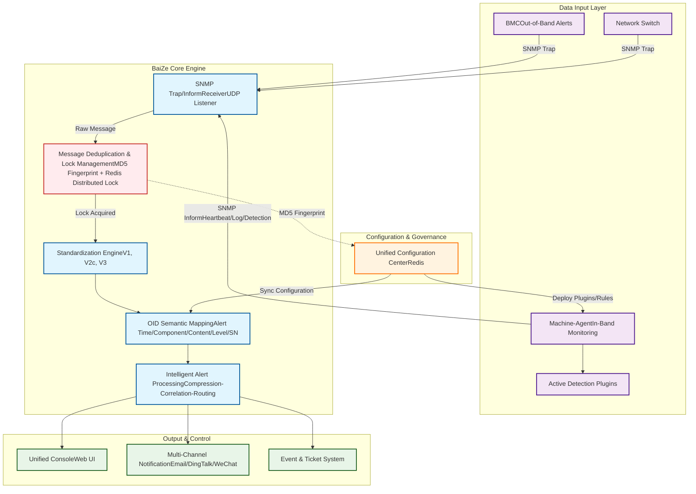

# BaiZe - Unified Hardware Monitoring Platform

## Project Overview

BaiZe is a unified hardware monitoring platform designed to address the complexity of hardware monitoring in enterprise data centers. By integrating in-band and out-of-band monitoring mechanisms, BaiZe can standardize BMC (Baseboard Management Controller) alerts from different vendors and provide proactive early warning capabilities to help operations teams detect and resolve hardware failures in advance.

## Architecture Design

The BaiZe platform adopts a distributed architecture, mainly consisting of the following components:

### Server Side

- **SNMP-trap Receiver**: Responsible for receiving SNMP-trap alert information from devices such as BMCs and switches
- **OID Mapping Configuration**: Standardizes vendor-specific alert information into a unified format
- **Alert Processing Engine**: Implements alert compression, correlation analysis, and routing functions
- **Configuration Management Module**: Synchronizes configuration information to various components via Redis

### Machine Agent

Lightweight agent deployed on physical machines, responsible for:

- **Heartbeat Reporting**: Regularly report device status to the server
- **System Log Monitoring**: Monitor abnormal information in system logs in real-time
- **Plugin-based Detection Scripts**: Support for extending various hardware detection scripts

## Core Advantages

1. **Unified**: Unified processing of multi-vendor hardware alerts, eliminating information silos
2. **Standardized**: Private alerts are converted into standard format through OID mapping
3. **Proactive**: Not only passively receives alerts but also actively discovers potential issues
4. **Scalable**: Plugin-based architecture supports flexible extension of detection capabilities
5. **Containerized Deployment**: Supports Docker and Kubernetes deployment for easy operations and maintenance

## Problems Solved

- Insufficient hardware failure early warning
- Vendor tools are isolated, lacking unified management
- System log anomalies are difficult to capture
- Inconsistent alert information formats from multi-vendor devices
- Lack of proactive monitoring capabilities

## Deployment Methods

BaiZe supports multiple deployment methods, including traditional physical machine deployment and containerized deployment, to meet different environmental requirements.

## Community and Contributions

We welcome you to join the BaiZe community and help improve this hardware monitoring platform. Whether you are a developer, operations engineer, or user interested in hardware monitoring, you are welcome to contribute code, documentation, or valuable suggestions to the project.

Submit Issues to report problems or suggest new features
Fork the project and submit Pull Requests to contribute code
Participate in discussions and documentation improvement work

[中文版本](README_CN.md)
