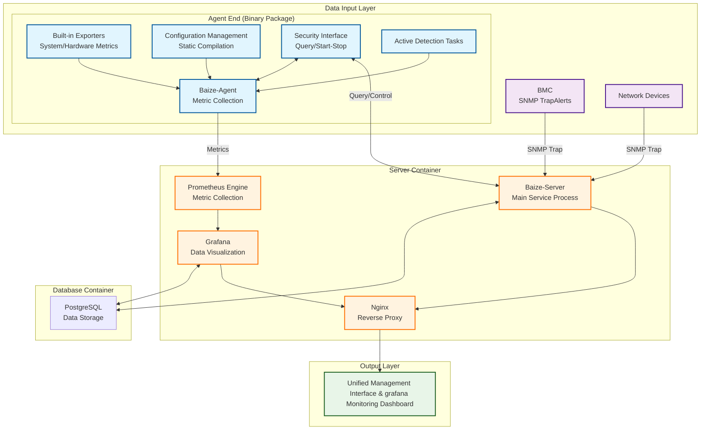

# BaiZe - Unified Hardware Monitoring Platform

## Project Overview

BaiZe is a unified hardware monitoring platform designed to address the complexity of hardware monitoring in enterprise data centers. By integrating in-band and out-of-band monitoring mechanisms, BaiZe can standardize BMC (Baseboard Management Controller) alerts from different vendors and provide proactive early warning capabilities to help operations teams detect and resolve hardware failures in advance.

## Architecture Design

The BaiZe platform adopts a modern microservices architecture, mainly consisting of the following components:

### Server Side (Main Application Container)

Core service components integrated in the main container:

- **BaiZe-Server**: Main service process, handling alert reception and business logic
- **Embedded Prometheus Engine**: Responsible for metric collection and rule-based alert generation  
- **Embedded Grafana**: Provides data visualization and monitoring dashboards
- **Nginx Reverse Proxy**: Internal service routing and load balancing

### Database (Independent Container)

- **PostgreSQL**: Independently deployed relational database
  - Stores alert data, user information, and configuration information
  - Provides data persistence and backup capabilities
  - Supports master-slave replication and high availability deployment

### Machine Agent (Binary Package Deployment)

Lightweight agent deployed on physical machines, adopting static compilation architecture:

- **Built-in Exporter Collection**: Dedicated metric collectors integrated at compile time
- **Configuration-driven Collection**: Control enabled monitoring items through configuration files
- **Minimal Interface**: Only expose necessary management API interfaces
- **Security Isolation**: No dynamic plugin loading, eliminating remote code execution risks


```mermaid
graph TB
   %% Style definitions
   classDef core fill:#e1f5fe,stroke:#01579b,stroke-width:2px
   classDef input fill:#f3e5f5,stroke:#4a148c,stroke-width:2px
   classDef container fill:#fff3e0,stroke:#ff6f00,stroke-width:2px
   classDef output fill:#e8f5e8,stroke:#1b5e20,stroke-width:2px

   %% Data Input Layer - Top
   subgraph "Data Input Layer"
      direction TB
      A1[BMC<br/>SNMP TrapAlerts]
      A2[Network Devices]

      %% Agent End - Below Input Layer, as main data source
      subgraph "Agent End (Binary Package)"
         direction LR
         C1[Built-in Exporters<br/>System/Hardware Metrics]
         C2[Configuration Management<br/>Static Compilation]
         C3[Security Interface<br/>Query/Start-Stop]
         C4[Active Detection Tasks]
         A3[Baize-Agent<br/>Metric Collection]
         C1 --> A3
         C2 --> A3
         C3 <--> A3
         C4 --> A3
      end
   end

   %% Server Container - Horizontal arrangement
   subgraph "Server Container"
      direction LR
      B2[Prometheus Engine<br/>Metric Collection]
      B1[Baize-Server<br/>Main Service Process]
      B3[Grafana<br/>Data Visualization]
      B5[Nginx<br/>Reverse Proxy]
   end

   %% Database Container
   subgraph "Database Container"
      B4[PostgreSQL<br/>Data Storage]
   end

   %% Output Layer - Bottom
   subgraph "Output Layer"
      D1[Unified Management Interface & grafana Monitoring Dashboard]
   end

   %% Connections
   A1 -->|SNMP Trap| B1
   A2 -->|SNMP Trap| B1
   A3 -->|Metrics| B2
   C3 <-->|Query/Control| B1
   B1 <--> B4
   B3 <--> B4
   B1 --> B5
   B3 --> B5
   B5 --> D1
   B2 --> B3

   class B1,B2,B3,B5 container
   class B4 database
   class A1,A2 input
   class C1,C2,C3,C4,A3 core
   class D1 output

```

## Core Advantages

1. **Microservices Architecture**: Independent database deployment improves system reliability
2. **Minimal Deployment**: Main service single-container deployment reduces operational complexity
3. **Security Control**: Agent static compilation architecture eliminates dynamic code execution risks
4. **Unified Management**: Configuration and data uniformly stored in PostgreSQL
5. **Standardization**: Reuse Prometheus ecosystem for standardized metric collection
6. **Active Monitoring**: Supports SNMP Trap passive reception and Agent active detection
7. **Visualization**: Embedded Grafana provides rich monitoring dashboards

## Problems Solved

- Inconsistent alert formats from multi-vendor devices
- Insufficient hardware failure early warning capabilities
- Vendor tools are isolated, forming information silos
- Lack of proactive discovery capabilities for system resource monitoring
- Complex deployment and high operational costs

## Deployment Process

1. **Database Deployment**
   ```bash
   docker run -p 5432:5432 -e POSTGRES_PASSWORD=your_password postgres:14
   ```

2. **Server Deployment**
   ```bash
   docker run -p 9988:9988 -p 9898:9898 -p 3000:3000 \
              -e DB_HOST=postgresql_host \
              -e DB_PASSWORD=your_password \
              baize/server:latest
   ```

3. **Agent Configuration**
   - Configure required monitoring items through Web interface
   - Generate customized Agent configuration files

4. **Agent Deployment**
   - Compile customized binary packages according to configuration
   - Distribute to target monitoring machines

5. **Service Discovery**
   - Batch upload monitoring target IP addresses
   - System automatically generates monitoring configuration

## Technical Features

- **Containerization Priority**: Production-grade Docker deployment support
- **Security First**: Minimal privilege principle, static compilation architecture
- **Observability**: Complete monitoring and alerting system

## Community and Contributions

We welcome you to join the BaiZe community and help improve this hardware monitoring platform. Whether you are a developer, operations engineer, or user interested in hardware monitoring, you are welcome to contribute code, documentation, or valuable suggestions to the project.

- Submit Issues to report problems or suggest new features
- Fork the project and submit Pull Requests to contribute code
- Participate in discussions and documentation improvement work

[中文版本](README_CN.md)