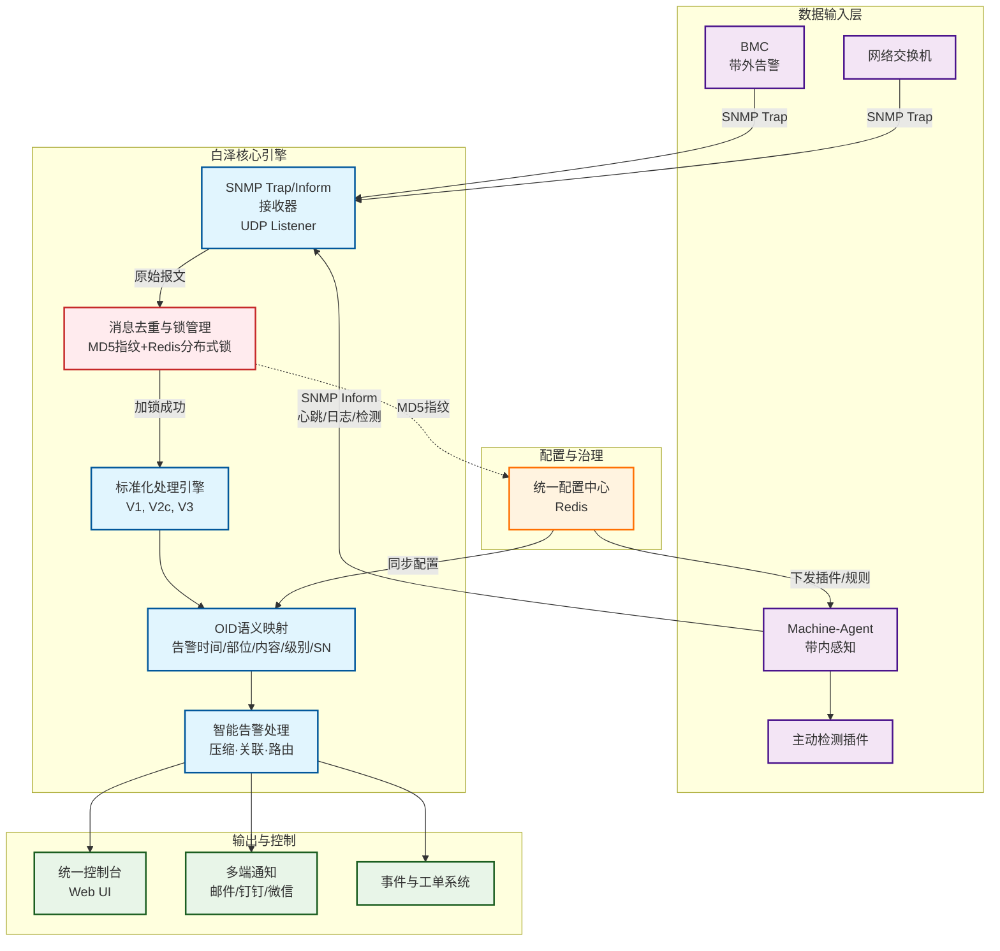

# 白泽(BaiZe) - 统一硬件监控平台

## 项目简介

白泽(BaiZe)是一个统一硬件监控平台，旨在解决企业数据中心硬件监控的复杂性问题。通过融合带内和带外监控机制，白泽能够标准化处理来自不同厂商的BMC(基板管理控制器)告警信息，并提供主动预警能力，帮助运维团队提前发现并处理硬件故障。

## 架构设计

白泽平台采用分布式架构，主要由以下组件构成：

### 服务端

- **SNMP-trap接收器**: 负责接收来自BMC、交换机等设备的SNMP-trap告警信息
- **OID映射配置**: 将不同厂商的私有告警信息标准化为统一格式
- **告警处理引擎**: 实现告警压缩、关联分析和路由功能
- **配置管理模块**: 通过Redis同步配置信息至各组件

### Machine Agent

部署在物理机上的轻量级代理，负责：

- **心跳上报**: 定期向服务端上报设备状态
- **系统日志监听**: 实时监控系统.logs中的异常信息
- **插件化检测脚本**: 支持扩展各类硬件检测脚本

## 核心优势

1. **统一性**: 统一处理多厂商硬件告警，消除信息孤岛
2. **标准化**: 通过OID映射将私有告警转化为标准格式
3. **主动性**: 不仅被动接收告警，还能主动发现潜在问题
4. **可扩展性**: 插件化架构支持灵活扩展检测能力
5. **容器化部署**: 支持Docker和Kubernetes部署，便于运维管理

## 解决的问题

- 硬件故障预警不足
- 厂商工具孤立，缺乏统一管理
- 系统日志异常难以捕捉
- 多厂商设备告警信息格式不统一
- 缺乏主动监控能力

## 部署方式

白泽支持多种部署方式，包括传统物理机部署和容器化部署，满足不同环境需求。

## 社区与贡献

诚邀您加入白泽社区，共同完善这个硬件监控平台。无论您是开发者、运维工程师还是对硬件监控感兴趣的用户，都欢迎为项目贡献代码、文档或提出宝贵建议。

提交Issue报告问题或建议新功能
Fork项目并提交Pull Request贡献代码
参与讨论和文档完善工作

[English Version](README.md)
