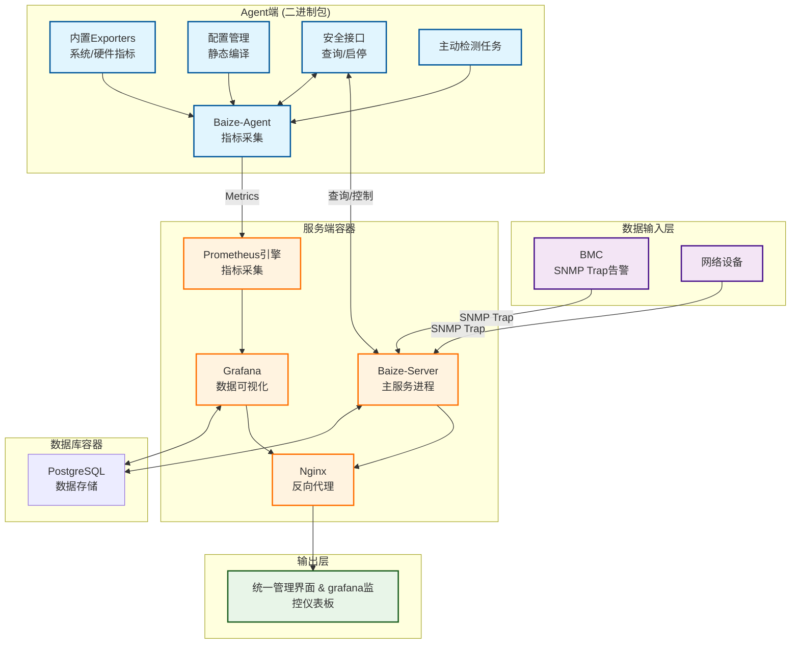

# 白泽(BaiZe) - 统一硬件监控平台

## 项目简介

白泽(BaiZe)是一个统一硬件监控平台，旨在解决企业数据中心硬件监控的复杂性问题。通过融合带内和带外监控机制，白泽能够标准化处理来自不同厂商的BMC(基板管理控制器)告警信息，并提供主动预警能力，帮助运维团队提前发现并处理硬件故障。

## 架构设计

白泽平台采用现代化的微服务架构，主要由以下组件构成：

### 服务端 (主应用容器)

核心服务组件集成在主容器中：

- **Baize-Server**: 主服务进程，处理告警接收和业务逻辑
- **内嵌Prometheus引擎**: 负责指标采集和规则告警生成  
- **内嵌Grafana**: 提供数据可视化和监控仪表板
- **Nginx反向代理**: 内部服务路由和负载均衡

### Machine Agent (二进制包部署)

部署在物理机上的轻量级代理，采用静态编译架构：

- **内置Exporter集合**: 编译时集成的专用指标采集器
- **配置驱动采集**: 通过配置文件控制启用的监控项
- **最小化接口**: 仅暴露必要的管理API接口
- **安全隔离**: 无动态插件加载，杜绝远程代码执行风险


```mermaid
graph TB
   %% 定义样式
   classDef core fill:#e1f5fe,stroke:#01579b,stroke-width:2px
   classDef input fill:#f3e5f5,stroke:#4a148c,stroke-width:2px
   classDef container fill:#fff3e0,stroke:#ff6f00,stroke-width:2px
   classDef output fill:#e8f5e8,stroke:#1b5e20,stroke-width:2px

   %% 数据输入层 - 顶部
   subgraph "数据输入层"
      direction TB
      A1[BMC<br/>SNMP Trap告警]
      A2[网络设备]
   end

   %% Agent端 - 位于输入层下方，作为主要数据源
   subgraph "Agent端 (二进制包)"
      direction LR   %% 水平排列使内部组件靠近输出侧
      C1[内置Exporters<br/>系统/硬件指标]
      C2[配置管理<br/>静态编译]
      C3[安全接口<br/>查询/启停]
      C4[主动检测任务]
      A3[Baize-Agent<br/>指标采集]
      C1 --> A3
      C2 --> A3
      C3 <--> A3
      C4 --> A3
   end

   %% 服务端容器 - 水平排列，从左到右：Prometheus, Server, Grafana, Nginx
   subgraph "服务端容器"
      direction LR
      B2[Prometheus引擎<br/>指标采集]
      B1[Baize-Server<br/>主服务进程]
      B3[Grafana<br/>数据可视化]
      B5[Nginx<br/>反向代理]
   end

   %% 数据库容器 - 独立于右侧
   subgraph "数据库容器"
      B4[PostgreSQL<br/>数据存储]
   end

   %% 输出层 - 底部
   subgraph "输出层"
      D1[统一管理界面 & grafana监控仪表板]
   end

   %% 连接关系（保持原逻辑）
   A1 -->|SNMP Trap| B1
   A2 -->|SNMP Trap| B1

   A3 -->|Metrics| B2          
   %% Agent指标直接进入Prometheus
  
   C3 <-->|查询/控制| B1       
   %% 安全接口与Server双向通信

   B1 <--> B4                  
   %% Server读写数据库
   B3 <--> B4                   
   %% Grafana读取数据库

   B1 --> B5                    
   %% Server通过Nginx暴露
   B3 --> B5                   
   %% Grafana通过Nginx暴露
   B5 --> D1                   
   %% Nginx代理至统一界面
   B2 --> B3

   %% 应用样式
   class B1,B2,B3,B5 container
   class B4 database
   class A1,A2 input
   class C1,C2,C3,C4,A3 core
   class D1 output
```

## 核心优势

1. **微服务架构**: 数据库独立部署，提高系统可靠性
2. **极简部署**: 主服务单容器化部署，降低运维复杂度
3. **安全可控**: Agent静态编译架构，杜绝动态代码执行风险
4. **统一管理**: 配置和数据统一存储在PostgreSQL中
5. **标准化**: 复用Prometheus生态，指标采集标准化
6. **主动监控**: 支持SNMP Trap被动接收和Agent主动检测
7. **可视化**: 内嵌Grafana提供丰富的监控仪表板

## 解决的问题

- 多厂商设备告警格式不统一
- 硬件故障预警能力不足
- 厂商工具孤立，形成信息孤岛
- 系统资源监控缺乏主动发现能力
- 部署复杂，运维成本高

## 部署使用流程

1. **数据库部署**
   ```bash
   docker run -p 5432:5432 -e POSTGRES_PASSWORD=your_password postgres:14
   ```

2. **服务端部署**
   ```bash
   docker run -p 9988:9988 -p 9898:9898 -p 3000:3000 \
              -e DB_HOST=postgresql_host \
              -e DB_PASSWORD=your_password \
              baize/server:latest
   ```

3. **Agent配置**
   - 通过Web界面配置需要的监控项
   - 生成定制化Agent配置文件

3. **Agent部署**
   - 根据配置编译定制化二进制包
   - 分发到目标监控机器

4. **服务发现**
   - 批量上传监控目标IP地址
   - 系统自动生成监控配置

## 技术特点

- **容器化优先**: 生产级Docker部署支持
- **安全第一**: 最小权限原则，静态编译架构
- **可观测性**: 完整的监控告警体系

## 社区与贡献

诚邀您加入白泽社区，共同完善这个硬件监控平台。无论您是开发者、运维工程师还是对硬件监控感兴趣的用户，都欢迎为项目贡献代码、文档或提出宝贵建议。

- 提交Issue报告问题或建议新功能
- Fork项目并提交Pull Request贡献代码
- 参与讨论和文档完善工作

[English Version](README.md)
