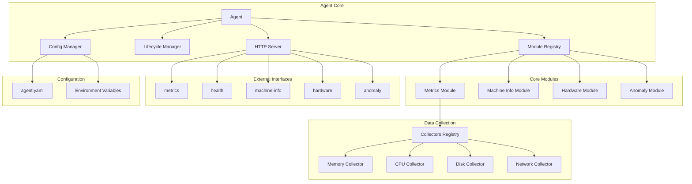
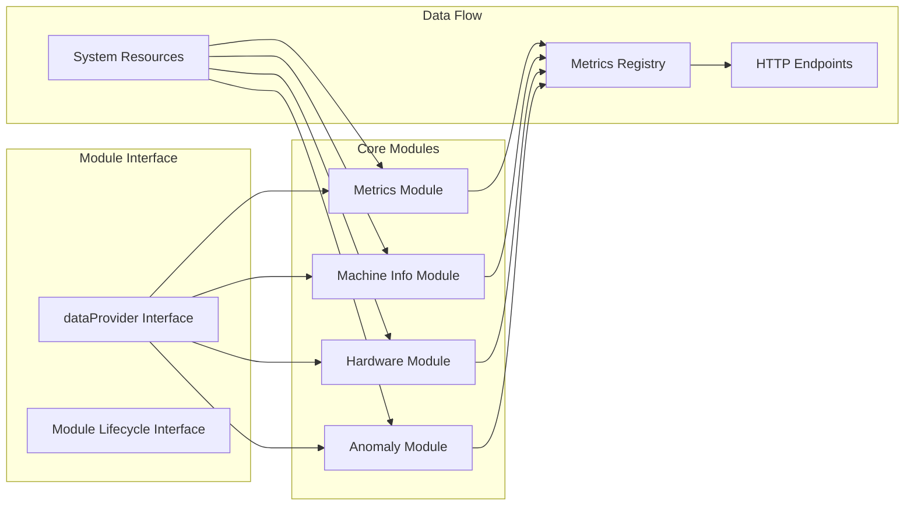
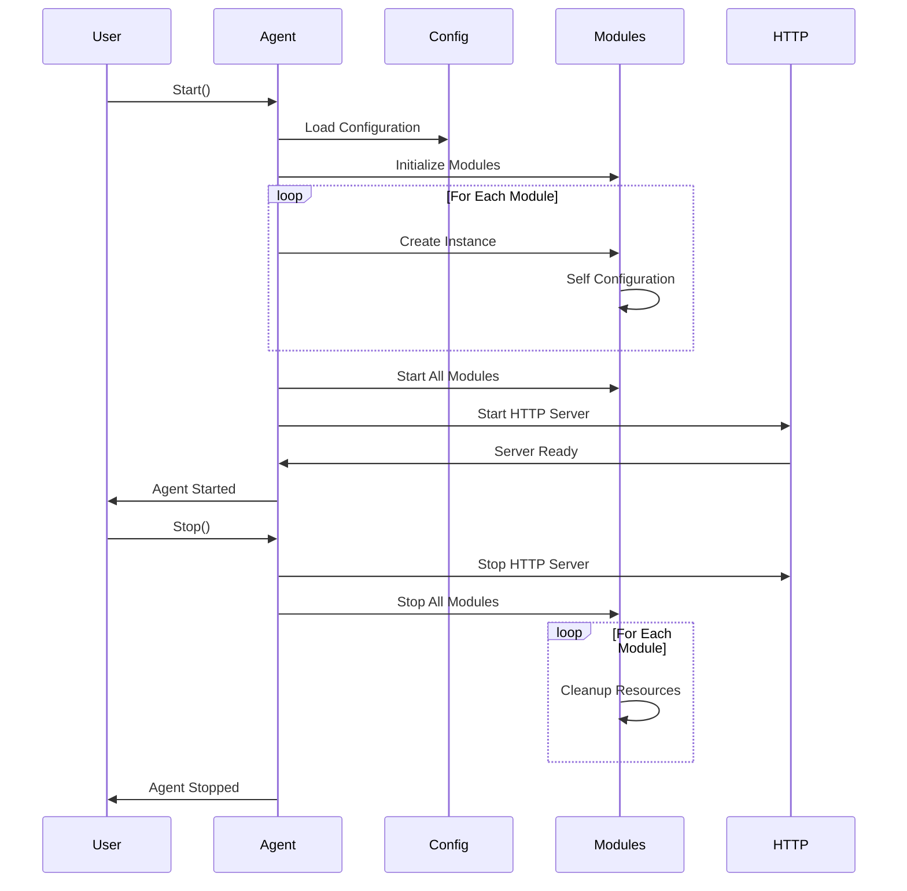
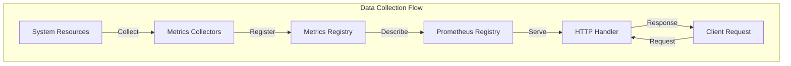

# Agent架构设计文档

## 概述

Agent是BaiZe监控平台的核心组件，负责在目标主机上收集系统指标、硬件信息、异常检测数据，并通过HTTP API对外提供监控数据。采用模块化设计，支持插件式扩展，基于Prometheus指标格式，确保与云原生生态的无缝集成。

## 整体架构



## 核心组件

### 1. Agent主结构
Agent作为中央协调器，负责：
- 模块生命周期管理（启动、停止、健康检查）
- 配置统一管理
- HTTP服务器启动和维护
- 模块间依赖关系协调
- 优雅关闭和异常恢复

### 2. 配置管理器
- 支持YAML配置文件和环境变量
- 配置项包括：服务器地址、心跳间隔、指标端口、日志级别
- 运行时配置热重载支持
- 配置验证和默认值处理

### 3. 生命周期管理器
- 统一的启动和停止流程
- 模块依赖关系管理
- 健康检查和状态监控
- 优雅关闭机制
- 异常恢复和重试策略

### 4. HTTP服务器
- 提供RESTful API接口
- 支持Prometheus指标格式
- 健康检查和状态监控
- 模块数据聚合和路由

## 模块架构



### 模块设计原则
1. **接口隔离**：每个模块实现统一的数据提供者接口
2. **依赖倒置**：模块间通过接口交互，降低耦合度
3. **单一职责**：每个模块专注于特定类型的数据收集
4. **可扩展性**：支持新模块的无缝集成

## 生命周期管理



## 配置管理

### 配置层次
1. **默认配置**：内置默认值
2. **文件配置**：agent.yaml配置文件
3. **环境变量**：运行时环境变量覆盖
4. **命令行参数**：启动参数最高优先级

### 配置结构
```yaml
agent:
  server_url: "http://localhost:8080"
  heartbeat_interval: "30s"
  metrics_port: 9100
  node_name: "agent-node-1"
  log_level: "info"

plugins:
  # 插件配置
  
exporters:
  # 导出器配置
```

## API设计

### RESTful端点
- **GET /metrics** - Prometheus指标格式数据
- **GET /health** - 健康检查状态
- **GET /api/v1/machine-info** - 机器基础信息
- **GET /api/v1/hardware** - 硬件详细信息
- **GET /api/v1/anomaly** - 异常检测结果

### 数据格式
- 指标数据：Prometheus文本格式
- API响应：JSON格式，统一包装结构
- 错误处理：标准HTTP状态码 + 错误详情

## 模块间交互



## 扩展性设计

### 1. 模块扩展
- 实现dataProvider接口即可添加新模块
- 模块自动注册机制
- 配置驱动的模块启用/禁用

### 2. 指标收集器扩展
- 基于Prometheus Collector接口
- 注册表模式管理收集器
- 自动发现和加载机制

### 3. 插件机制
- 配置驱动的插件管理
- 工具调用方式实现监控功能
- 安全优先的静态架构

## 安全考虑

### 1. 架构安全
- 静态编译，无动态代码加载
- 配置驱动的功能开关
- 最小权限原则

### 2. 数据安全
- 本地数据收集，无远程代码执行
- 系统命令调用的参数验证
- 敏感信息脱敏处理

### 3. 网络安全
- HTTP服务端点访问控制
- 数据传输无敏感信息
- 健康检查端点公开，业务端点可配置认证

## 性能优化

### 1. 并发设计
- 模块独立运行，无相互阻塞
- 指标收集异步执行
- HTTP请求并发处理

### 2. 资源管理
- 内存复用和池化
- 定时器优化，避免频繁创建
- 连接复用和超时控制

### 3. 监控优化
- 指标缓存机制
- 采样频率自适应
- 异常检测算法优化

## 相关文档

- [Metrics模块设计](metrics.md) - 详细介绍指标收集和插件机制
- [Machine Info模块](machine_info.md) - 机器信息收集实现
- [Hardware模块](hardware.md) - 硬件信息收集实现  
- [Anomaly模块](anomaly.md) - 异常检测实现
- [配置说明](../config/agent.yaml) - 配置文件详细说明