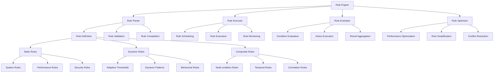
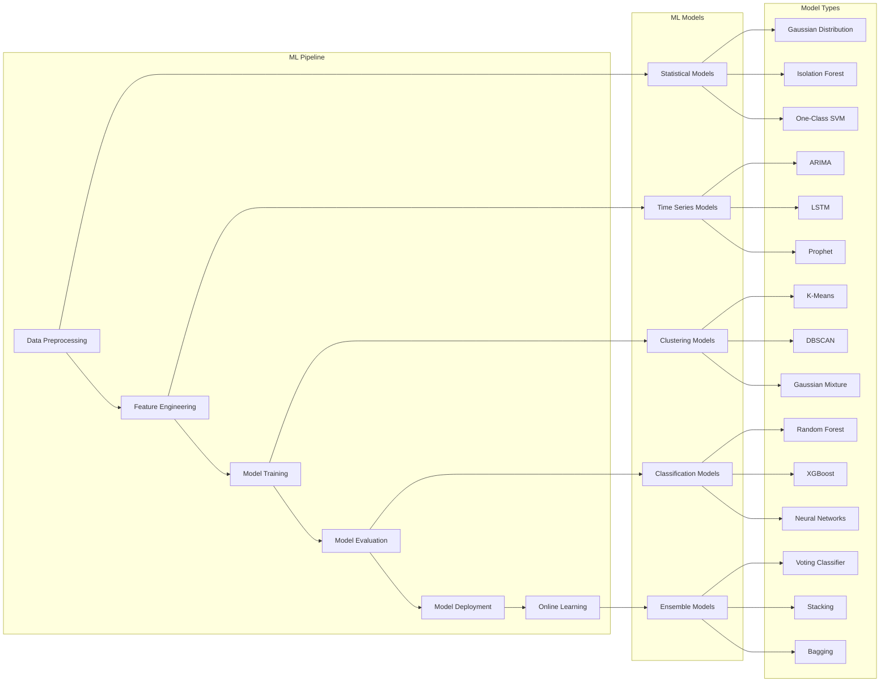
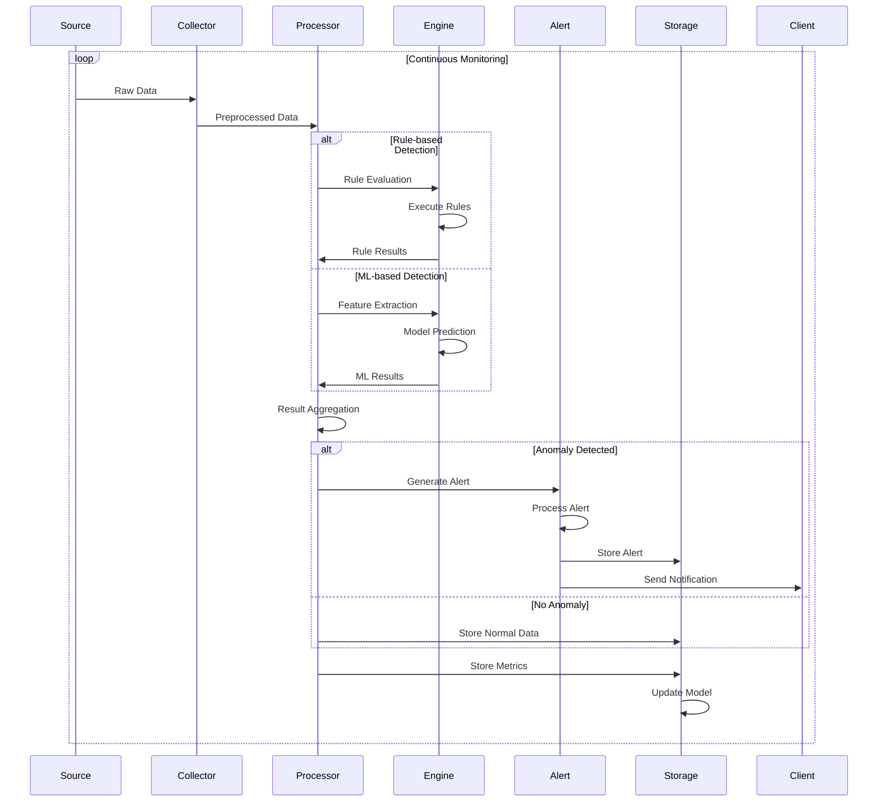
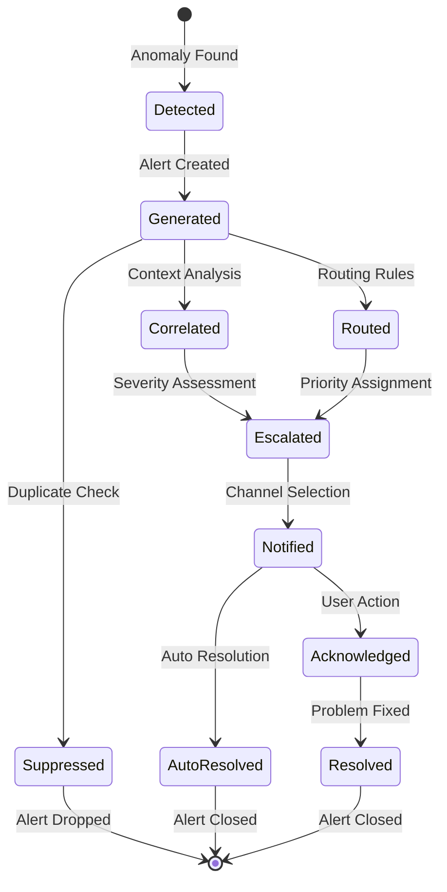

# Anomaly模块设计文档

## 概述

Anomaly模块是Agent的智能异常检测引擎，负责实时监控系统运行状态，识别异常行为和潜在问题。通过多维度数据分析和机器学习算法，提供主动的问题发现和预警能力，确保系统的稳定运行和及时维护。

## 架构设计

```mermaid
graph TB
    subgraph "Anomaly Module Core"
        A[Anomaly Manager] --> B[Detection Engine]
        A --> C[Rule Engine]
        A --> D[ML Engine]
        A --> E[Alert Manager]
        A --> F[Data Processor]
    end
    
    subgraph "Detection Types"
        B --> G[System Anomalies]
        B --> H[Performance Anomalies]
        B --> I[Resource Anomalies]
        B --> J[Security Anomalies]
        B --> K[Application Anomalies]
    end
    
    subgraph "Rule Engine"
        C --> L[Static Rules]
        C --> M[Dynamic Rules]
        C --> N[Threshold Rules]
        C --> O[Pattern Rules]
        C --> P[Composite Rules]
    end
    
    subgraph "ML Engine"
        D --> Q[Statistical Models]
        D --> R[Time Series Models]
        D --> S[Clustering Models]
        D --> T[Classification Models]
        D --> U[Ensemble Models]
    end
    
    subgraph "Data Sources"
        F --> V[Metrics Data]
        F --> W[Logs Data]
        F --> X[Events Data]
        F --> Y[System Calls]
        F --> Z[Network Data]
    end
    
    subgraph "Alert Management"
        E --> AA[Alert Generation]
        E --> AB[Alert Routing]
        E --> AC[Alert Suppression]
        E --> AD[Alert Correlation]
        E --> AE[Alert Escalation]
    end
    
    V --> F
    W --> F
    X --> F
    Y --> F
    Z --> F
    
    G --> AA
    H --> AA
    I --> AA
    J --> AA
    K --> AA
    
    L --> G
    M --> H
    N --> I
    O --> J
    P --> K
    
    Q --> G
    R --> H
    S --> I
    T --> J
    U --> K
```



## 核心功能

### 1. 系统异常检测
监控系统级别的异常行为：
- **进程异常**：异常进程行为、僵尸进程、资源泄漏
- **系统调用异常**：异常的系统调用模式
- **文件系统异常**：异常的文件访问模式、权限变更
- **内核异常**：内核panic、oops、模块加载异常
- **启动异常**：服务启动失败、依赖关系异常

### 2. 性能异常检测
识别性能相关的异常情况：
- **CPU异常**：CPU使用率突增、负载异常、频率异常
- **内存异常**：内存泄漏、内存使用率异常、OOM事件
- **磁盘异常**：磁盘I/O异常、磁盘空间异常、磁盘错误
- **网络异常**：网络延迟异常、丢包异常、连接异常
- **响应时间异常**：服务响应时间突增、超时异常

### 3. 资源异常检测
监控资源使用的异常模式：
- **资源耗尽**：CPU、内存、磁盘、网络资源耗尽
- **资源争用**：资源竞争导致的性能下降
- **资源泄漏**：内存泄漏、文件句柄泄漏、连接泄漏
- **资源滥用**：异常的资源消耗模式
- **容量异常**：容量规划异常、扩容需求预测

### 4. 安全异常检测
发现潜在的安全威胁：
- **登录异常**：异常登录模式、暴力破解尝试
- **权限异常**：权限提升、异常权限变更
- **网络异常**：异常网络连接、端口扫描
- **文件异常**：异常文件修改、恶意文件检测
- **进程异常**：异常进程创建、恶意进程检测

### 5. 应用异常检测
监控应用程序的异常行为：
- **错误率异常**：应用错误率突增
- **流量异常**：异常流量模式、DDoS攻击
- **依赖异常**：外部依赖服务异常
- **配置异常**：配置变更导致的异常
- **业务异常**：业务指标异常、交易异常

## 检测引擎

### 规则引擎



#### 规则类型
1. **静态规则**：基于固定阈值的检测规则
2. **动态规则**：基于历史数据自适应调整的规则
3. **复合规则**：多个条件组合的综合规则
4. **时序规则**：基于时间序列模式的规则
5. **关联规则**：多指标关联分析的规则

### 机器学习引擎



#### 机器学习算法
1. **统计模型**：基于统计分布的异常检测
2. **时间序列模型**：基于时间序列预测的异常检测
3. **聚类模型**：基于数据聚类的异常检测
4. **分类模型**：基于监督学习的异常分类
5. **集成模型**：多模型集成的综合检测

## 数据处理流程



## 规则配置

### 静态规则配置
```yaml
anomaly_rules:
  system_rules:
    - name: "high_cpu_usage"
      description: "CPU使用率过高"
      condition: "cpu_usage > 90"
      duration: "5m"
      severity: "warning"
      action: "alert"
      
    - name: "memory_leak"
      description: "内存泄漏检测"
      condition: "memory_usage > 80 AND memory_growth_rate > 5"
      duration: "10m"
      severity: "critical"
      action: "alert_and_log"
      
  performance_rules:
    - name: "disk_io_spike"
      description: "磁盘I/O异常突增"
      condition: "disk_io_rate > baseline * 3"
      duration: "2m"
      severity: "warning"
      action: "alert"
      
  security_rules:
    - name: "failed_login_spike"
      description: "登录失败次数突增"
      condition: "failed_logins > 10"
      duration: "1m"
      severity: "critical"
      action: "alert_and_block"
```

### 动态规则配置
```yaml
dynamic_rules:
  adaptive_thresholds:
    - name: "cpu_baseline"
      metric: "cpu_usage"
      algorithm: "ewma"
      window: "1h"
      sensitivity: 2.5
      
    - name: "memory_baseline"
      metric: "memory_usage"
      algorithm: "holt_winters"
      window: "24h"
      seasonality: "daily"
      
  behavioral_rules:
    - name: "network_behavior"
      metric: "network_traffic"
      pattern: "daily_pattern"
      deviation_threshold: 0.3
      learning_period: "7d"
```

### 复合规则配置
```yaml
composite_rules:
  - name: "system_overload"
    description: "系统过载检测"
    conditions:
      - "cpu_usage > 85"
      - "memory_usage > 85"
      - "disk_io_wait > 50"
    operator: "AND"
    duration: "3m"
    severity: "critical"
    
  - name: "performance_degradation"
    description: "性能下降检测"
    conditions:
      - "response_time > baseline * 2"
      - "error_rate > 5%"
      - "throughput < baseline * 0.8"
    operator: "OR"
    duration: "5m"
    severity: "warning"
```

## 机器学习配置

### 模型训练配置
```yaml
ml_configuration:
  data_preprocessing:
    - name: "standardization"
      method: "z_score"
      apply_to: ["cpu_usage", "memory_usage", "disk_io"]
      
    - name: "normalization"
      method: "min_max"
      apply_to: ["network_traffic", "response_time"]
      
  feature_engineering:
    - name: "time_features"
      type: "temporal"
      features: ["hour", "day_of_week", "is_weekend"]
      
    - name: "statistical_features"
      type: "rolling"
      window: "1h"
      features: ["mean", "std", "max", "min"]
      
  model_configuration:
    isolation_forest:
      n_estimators: 100
      contamination: 0.1
      random_state: 42
      
    lstm_autoencoder:
      hidden_dim: 64
      sequence_length: 24
      num_layers: 2
      dropout: 0.2
      
    prophet:
      seasonality_mode: "multiplicative"
      yearly_seasonality: true
      weekly_seasonality: true
      daily_seasonality: true
```

### 在线学习配置
```yaml
online_learning:
  update_frequency: "1h"
  learning_rate: 0.01
  batch_size: 1000
  
  drift_detection:
    method: "adwin"
    delta: 0.002
    clock: 32
    
  model_ensemble:
    models: ["isolation_forest", "lstm", "prophet"]
    voting: "soft"
    weights: [0.4, 0.3, 0.3]
```

## 告警管理

### 告警生命周期



### 告警配置
```yaml
alert_management:
  suppression_rules:
    - name: "duplicate_suppression"
      window: "5m"
      fields: ["alert_type", "resource_id"]
      
    - name: "maintenance_suppression"
      schedule: "0 2 * * *"
      duration: "2h"
      alert_types: ["system_maintenance"]
      
  correlation_rules:
    - name: "cascade_failures"
      correlation_window: "10m"
      correlation_fields: ["service", "dependency"]
      
  escalation_rules:
    - name: "critical_escalation"
      severity: "critical"
      escalation_delay: "15m"
      escalation_targets: ["manager", "oncall"]
      
  notification_channels:
    - name: "email"
      type: "smtp"
      config:
        smtp_server: "smtp.example.com"
        recipients: ["ops@example.com"]
        
    - name: "slack"
      type: "webhook"
      config:
        webhook_url: "https://hooks.slack.com/..."
        channel: "#alerts"
        
    - name: "pagerduty"
      type: "pagerduty"
      config:
        service_key: "your_service_key"
        escalation_policy: "default"
```

## 性能优化

### 1. 检测优化
- **批处理**：批量处理多个检测任务
- **并行化**：并行执行独立的检测规则
- **缓存**：缓存中间计算结果
- **增量计算**：只计算变化的部分

### 2. 模型优化
- **模型压缩**：压缩机器学习模型
- **特征选择**：选择最重要的特征
- **近似算法**：使用近似算法加速计算
- **硬件加速**：利用GPU加速计算

### 3. 存储优化
- **数据压缩**：压缩历史数据
- **分层存储**：热数据和冷数据分层存储
- **索引优化**：优化查询索引
- **数据清理**：定期清理过期数据

## 监控和可观测性

### 内部指标
- `anomaly_detection_rate` - 异常检测率
- `anomaly_false_positive_rate` - 误报率
- `anomaly_detection_latency_seconds` - 检测延迟
- `anomaly_rule_evaluation_duration_seconds` - 规则评估耗时
- `anomaly_model_prediction_duration_seconds` - 模型预测耗时
- `anomaly_alert_generation_rate` - 告警生成率

### 模型性能指标
- `model_accuracy` - 模型准确率
- `model_precision` - 模型精确率
- `model_recall` - 模型召回率
- `model_f1_score` - F1分数
- `model_auc_roc` - AUC-ROC分数
- `model_training_duration_seconds` - 模型训练耗时

## 安全考虑

### 1. 数据安全
- **数据加密**：加密敏感数据
- **访问控制**：控制数据访问权限
- **数据脱敏**：脱敏敏感信息
- **审计日志**：记录数据访问日志

### 2. 模型安全
- **模型验证**：验证模型的完整性
- **对抗攻击**：防范对抗性攻击
- **模型解释**：提供模型解释能力
- **偏见检测**：检测模型偏见

### 3. 系统安全
- **输入验证**：验证输入数据
- **权限控制**：最小权限原则
- **错误处理**：安全的错误处理
- **日志保护**：保护日志信息

## 相关文档

- [Agent架构设计](agent.md) - Agent整体架构
- [Metrics模块设计](metrics.md) - 指标收集模块
- [Machine Info模块](machine_info.md) - 机器信息模块
- [Hardware模块](hardware.md) - 硬件信息模块
- [配置说明](../config/agent.yaml) - 配置文件详细说明
- [机器学习最佳实践](ml_best_practices.md) - 机器学习模型优化（待创建）