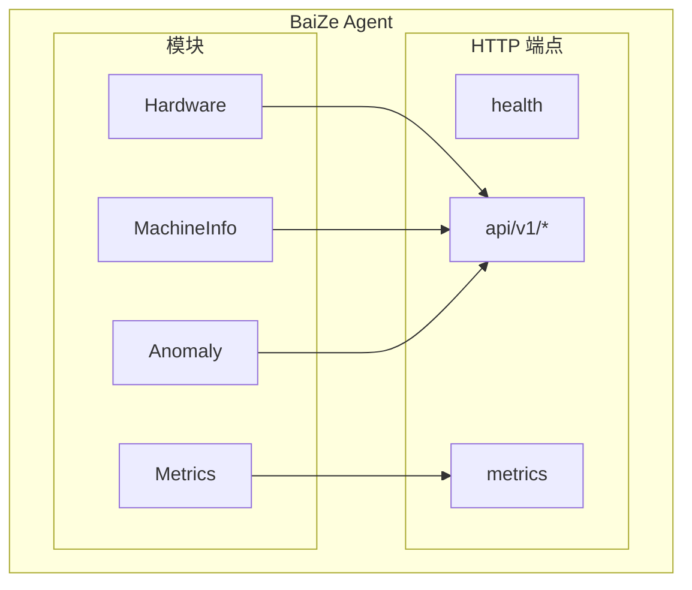

# BaiZe Agent 快速开始

BaiZe Agent 是白泽监控系统的轻量级客户端，部署在被监控的服务器上，负责采集硬件信息、机器信息、异常检测，并暴露 Prometheus 监控指标。


---

## 🎯 核心功能

| 功能 | 描述 |
|------|------|
| **硬件信息采集** | CPU、内存、磁盘、网络等硬件详细信息 |
| **机器信息采集** | 操作系统、内核版本、主机名、IP 地址等 |
| **异常检测** | 基于规则检测硬件异常（CPU 变化、内存 ECC 错误、磁盘 IO 错误、网络链路中断） |
| **指标暴露** | 提供 Prometheus 格式的监控指标 |

---

## �️ 架构概览



**4 个核心模块**：
- **Hardware** - 硬件信息采集
- **MachineInfo** - 机器信息
- **Anomaly** - 异常检测
- **Metrics** - Prometheus 指标

---

##  快速启动

### 1. 编译 Agent

```bash
cd /Users/zhaojunjie/goProject/baize-monitor

# 使用 Makefile 编译
make build-agent

# 或直接使用 go build
go build -o bin/baize-agent ./cmd/agent
```

### 2. 配置文件

 `config/agent.yaml`：

```yaml
metrics_port: 9100
node_name: "node-1"
log_level: "info"
```

### 3. 启动 Agent

```bash
# 直接启动（自动读取 config/agent.yaml）
./bin/baize-agent
```

**配置加载**：
 自动读取 `./config/agent.yaml` 


---

## ✅ 测试验证

### 健康检查

```bash
curl http://localhost:9100/health
```

**预期响应**：
```json
{
  "code": 200,
  "success": true,
  "message": "healthy",
  "data": {
    "node_name": "node-1",
    "uptime": "10s",
    "version": "1.0.0"
  }
}
```

### 查看机器信息

```bash
curl http://localhost:9100/api/v1/machine-info | jq .
```

**预期响应**：
```json
{
  "code": 200,
  "success": true,
  "message": "success",
  "data": {
    "hostname": "node-1",
    "ip_addresses": {...}
  }
}
```

### 查看硬件信息

```bash
curl http://localhost:9100/api/v1/hardware | jq .
```

**预期响应**：包含 CPU、内存、磁盘、网络信息

### 查看异常检测

```bash
curl http://localhost:9100/api/v1/anomaly | jq .
```

**预期响应**：检测结果列表

### 查看 Prometheus 指标

```bash
curl http://localhost:9100/metrics
```

**预期响应**：
```
# HELP baize_metrics_memory_usage_percent Memory usage percentage
# TYPE baize_metrics_memory_usage_percent gauge
baize_metrics_memory_usage_percent 45.6
# HELP baize_metrics_cpu_usage_percent CPU usage percentage
baize_metrics_cpu_usage_percent 12.3
```

---

## 🌐 HTTP API

| 端点 | 方法 | 功能 |
|------|------|------|
| `/health` | GET | 健康检查 |
| `/metrics` | GET | Prometheus 指标 |
| `/api/v1/machine-info` | GET | 机器信息 |
| `/api/v1/hardware` | GET | 硬件信息 |
| `/api/v1/anomaly` | GET | 异常检测结果 |

**响应格式**：
```json
{
  "code": 200,
  "success": true,
  "message": "success",
  "data": { ... }
}
```

---

## 🎯 设计特点

- **高度模块化** - 4 个独立模块，职责单一
- **插件化设计** - 采集器和检测器支持动态注册
- **统一接口** - 所有模块实现 `getData()` 接口
- **并发安全** - mutex 保护共享数据
- **优雅关闭** - 上下文取消和 WaitGroup 等待

---

## 📖 下一步

- **[架构文档](README.md)** - 深入了解架构设计
- **[模块设计](modules.md)** - 了解模块交互和插件机制
- **[硬件采集](modules/hardware/README.md)** - 硬件采集器详解
- **[异常检测](modules/anomaly/README.md)** - 异常检测器详解

---

[🔝 返回顶部](#baiZe-agent-快速开始)
