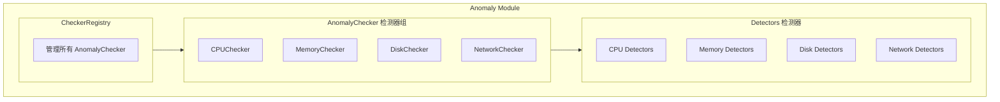

# 异常检测模块概览

## 1. 模块职责

异常检测模块负责检测系统硬件和资源的异常情况，包括 CPU、内存、磁盘和网络四个维度。

### 核心职责
- **检测器管理**：通过插件化架构管理各类检测器
- **异常识别**：识别硬件故障、配置异常、性能退化
- **结果上报**：生成标准化的异常检测结果

## 2. 架构

## 3. 核心接口

### Detector 接口
所有检测器必须实现的基础接口

### AnomalyChecker 接口
检测器分组管理器接口

### CheckerRegistry
注册表管理所有检测器组，执行全局检测

## 4. 检测器类型

| 检测类型 | 检测器数量 | 说明 |
|---------|-----------|------|
| CPU | 2 | CPU 核心数异常 |
| 内存 | 2 | ECC 错误 |
| 磁盘 | 2 | I/O 错误 |
| 网络 | 2 | 链路状态 |

## 5. 异常级别

- **info** - 信息级
- **warning** - 警告级
- **critical** - 严重级

## 6. 检测结果

AnomalyResult 包含：
- CheckType: 检测类型
- CheckItem: 检测项名称
- Success: 是否成功
- Level: 异常级别
- Message: 异常信息
- ExtraData: 额外数据
- CheckedAt: 检测时间

## 7. 设计原则

### 零影响原则
- 只读内核缓存数据
- 不影响系统性能

### 持续性原则
- 检测累积性问题
- 非瞬时波动

### 轻量级原则
- 单次检测 < 100ms
- 内存占用 < 10MB

### 错误处理
- 检测失败返回 error
- 由 Registry 统一处理
- 错误信息记录到 Message 字段

## 8. 特点

- **插件化架构** - 检测器自动注册
- **分组管理** - 按检测对象分组
- **统一接口** - 所有检测器实现相同接口
- **标准化输出** - 统一的异常结果格式
- **静默失败** - 检测器失败不影响其他

## 相关文档

- [插件架构详解](02-plugin-architecture.md)
- [检测器总览](03-detectors/README.md)
- [扩展指南](04-extensibility.md)
