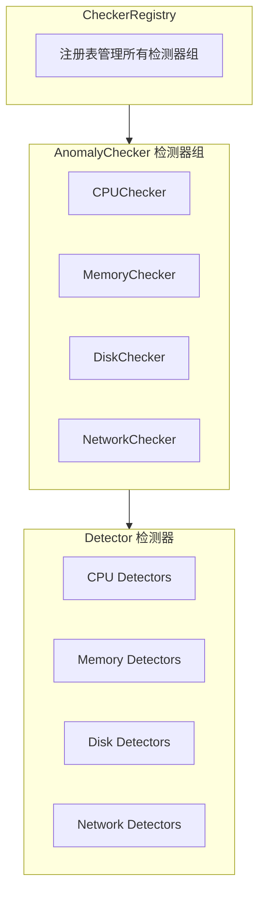

# 插件架构详解

## 1. 概述

异常检测模块采用**插件化架构**，通过自动注册机制实现检测器的即插即用。

## 2. 三层架构



### 组件职责

| 组件 | 职责 |
|------|------|
| **Detector** | 执行具体检测逻辑 |
| **AnomalyChecker** | 管理一组 Detector |
| **CheckerRegistry** | 管理所有 AnomalyChecker |

## 3. 自动注册机制

### 注册流程

1. **检测器注册** - 检测器在 `init()` 中自动注册到子包
2. **子包导出** - 子包导出 `RegisterDetector` 函数
3. **Checker 获取** - Checker 在创建时获取所有已注册的检测器
4. **注册到 Registry** - 主模块注册 Checker 到 Registry

### 注册时序

```
应用程序导入包 → 触发 init() → 注册 Detector → 
创建 Checker → 获取所有 Detector → 注册到 Registry
```

## 4. 检测器组模式

每个检测对象（CPU/内存/磁盘/网络）都有一个 Checker，负责管理该组的所有检测器。

### Checker 职责

- 管理该组的所有 Detector
- 实现 `AnomalyChecker` 接口
- 提供 `CheckType()` 和 `GetAllDetectors()` 方法

## 5. Registry 工作原理

### 注册 Checker

Registry 管理所有 Checker，提供 `Register()` 方法

### 执行检测

调用 `CheckerAll()` 依次执行所有 Checker 的 Detector

## 6. 错误处理

### 错误隔离

每个 Detector 独立执行，一个失败不影响其他

### 错误记录

检测失败时，记录到 AnomalyResult 的 Message 字段

## 7. 扩展方法

添加新检测器：
1. 在对应子包创建 Detector
2. 实现 `Detector` 接口
3. 在 `init()` 中自动注册

## 相关文档

- [模块概览](01-overview.md) - 高层介绍
- [检测器总览](03-detectors/README.md) - 接口定义
- [扩展指南](04-extensibility.md) - 添加新检测器
