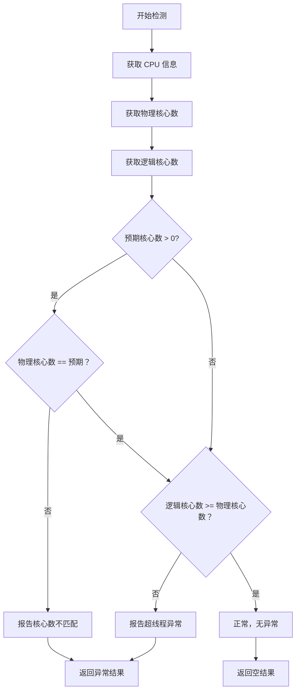

# CPU 检测器

## 1. 概述

CPU 检测器负责检测 CPU 相关的异常情况，包括核心数不匹配、超线程异常等问题。

**检测对象**：CPU 硬件和配置
**检测器数量**：2 个（1 个功能检测器 + 1 个示例检测器）
**特殊考虑**：使用 gopsutil 库，避免频繁调用

## 2. 检测器列表

| 检测器 | 检测项名称 | 异常级别 | 说明 |
|--------|-----------|---------|------|
| cpu_core_count_mismatch | cpu_core_count_mismatch | warning | CPU 核心数不匹配 |
| cpu_example | cpu_example | - | 示例模板 |

## 3. 检测器详解

### 3.1 cpu_core_count_mismatch

**功能**：检测 CPU 核心数是否与预期不符或超线程异常

**实现文件**：[cpu_core_count_mismatch_detector.go](https://github.com/zhaojunjie/baize-monitor/blob/main/internal/agent/anomaly/cpu/cpu_core_count_mismatch_detector.go)

#### 检测逻辑流程



#### 检测场景

**场景 1：核心数不匹配**
- **现象**：预期 8 核，实际 4 核
- **可能原因**：
  - CPU 故障
  - 配置错误
  - 虚拟化限制
  - BIOS 设置问题

**场景 2：超线程禁用**
- **现象**：物理核心数 > 逻辑核心数
- **可能原因**：
  - BIOS 中禁用超线程
  - CPU 降级
  - 超线程硬件故障

#### 返回数据示例

```json
{
  "check_type": "cpu",
  "check_item": "cpu_core_count_mismatch",
  "success": false,
  "level": "warning",
  "message": "CPU core count mismatch detected",
  "extra_data": {
    "expected_cores": 8,
    "actual_physical_cores": 4,
    "actual_logical_cores": 8,
    "cpu_count": 1,
    "issue": "core_count_mismatch"
  },
  "checked_at": "2024-01-01T10:00:00Z"
}
```

#### 依赖的数据源

**gopsutil CPU API**：
- `gopsutilcpu.Info()`: 获取 CPU 基本信息
- `gopsutilcpu.Counts(false)`: 获取物理核心数
- `gopsutilcpu.Counts(true)`: 获取逻辑核心数

**系统文件**（备用）：
- `/proc/cpuinfo`: CPU 详细信息
- `/proc/stat`: CPU 时间统计

### 3.2 cpu_example

**功能**：示例检测器模板

**实现文件**：[example_detector.go](https://github.com/zhaojunjie/baize-monitor/blob/main/internal/agent/anomaly/cpu/example_detector.go)

**用途**：
- 作为开发新 CPU 检测器的参考
- 展示检测器的标准结构
- 提供最佳实践示例

**使用方法**：
1. 复制 `example_detector.go` 为新文件
2. 修改检测逻辑实现具体功能
3. 取消注释 `init()` 函数以启用注册

## 4. 数据源

### 4.1 gopsutil CPU API

**推荐方式**：使用 gopsutil 库获取 CPU 信息

```go
import gopsutilcpu "github.com/shirou/gopsutil/v3/cpu"

// CPU 基本信息
cpuInfos, _ := gopsutilcpu.Info()

// 核心数
physicalCores, _ := gopsutilcpu.Counts(false)  // 物理核心
logicalCores, _ := gopsutilcpu.Counts(true)    // 逻辑核心

// CPU 使用率
percent, _ := gopsutilcpu.Percent(time.Second, false)

// CPU 频率
freq, _ := gopsutilcpu.Frequency()
```

### 4.2 系统文件

**备用方式**：直接读取系统文件

```go
// /proc/cpuinfo
data, _ := os.Open("/proc/cpuinfo")

// /proc/stat (CPU 时间统计)
stat, _ := os.Open("/proc/stat")
```

### 4.3 系统命令

**调试工具**：
```bash
# 查看 CPU 信息
lscpu

# 查看详细 CPU 信息
cat /proc/cpuinfo

# 查看核心数
nproc
```

## 5. 扩展示例

### 5.1 CPU 温度检测器

**功能**：检测 CPU 温度是否超过阈值

**实现思路**：
1. 读取 `/sys/class/thermal/thermal_zone*/temp`
2. 解析温度值（单位：毫摄氏度）
3. 转换为摄氏度并检查阈值
4. 返回异常结果

**伪代码**：
```go
func (d *cpuTemperatureDetector) Detect() (request.AnomalyResult, error) {
    // 1. 读取温度文件
    // 2. 转换为摄氏度
    // 3. 检查是否超过阈值
    if temp > d.threshold {
        return utils.CreateAnomalyResult(
            models.CheckTypeCPU,
            "cpu_temperature",
            models.AnomalyLevelWarning,
            "CPU temperature is too high",
            map[string]interface{}{
                "temperature": temp,
                "threshold": d.threshold,
            },
        ), nil
    }
    return request.AnomalyResult{}, nil
}
```

### 5.2 CPU 频率检测器

**功能**：检测 CPU 频率是否过低

**实现思路**：
1. 使用 `gopsutilcpu.Frequency()` 获取频率
2. 检查当前频率是否低于最低预期
3. 返回异常结果

### 5.3 CPU 使用率持续过高

**功能**：检测长期高负载

**实现思路**：
1. 周期性采集 CPU 使用率
2. 计算平均使用率
3. 检查是否持续超过阈值

## 6. 调试方法

### 6.1 查看 CPU 信息

```bash
# 使用 lscpu
lscpu

# 查看 /proc/cpuinfo
cat /proc/cpuinfo

# 查看核心数
nproc
```

### 6.2 测试检测器

```go
package cpu

import (
    "testing"
    "log"
)

func TestCPUCoreCountDetector(t *testing.T) {
    detector := &cpuCoreCountMismatchDetector{
        expectedCores: 0, // 0 表示不检查预期值
    }
    
    result, err := detector.Detect()
    if err != nil {
        t.Errorf("Detect() error = %v", err)
    }
    
    log.Printf("Result: %+v", result)
}
```

### 6.3 手动测试

```go
detector := &cpuCoreCountMismatchDetector{
    expectedCores: 8,
}

result, err := detector.Detect()
if err != nil {
    log.Printf("Error: %v", err)
}

if result.Success {
    log.Println("No anomaly detected")
} else {
    log.Printf("Anomaly: %s - %s", result.Level, result.Message)
    log.Printf("Extra: %+v", result.ExtraData)
}
```

## 7. 最佳实践

### 7.1 性能考虑

**✅ 推荐**：只读取必要的数据
```go
func (d *detector) Detect() (request.AnomalyResult, error) {
    physicalCores, _ := gopsutilcpu.Counts(false)
    // 只做必要的检查
}
```

**❌ 避免**：频繁调用或获取不必要的数据
```go
func (d *detector) Detect() (request.AnomalyResult, error) {
    for i := 0; i < 10; i++ {
        gopsutilcpu.Percent(time.Second, false)  // 耗时操作
    }
}
```

### 7.2 错误处理

**静默失败**（非关键错误）：
```go
cpuInfo, err := gopsutilcpu.Info()
if err != nil {
    return request.AnomalyResult{}, nil  // 不返回错误
}
```

**返回错误**（关键错误）：
```go
file, err := os.Open("/critical/file")
if err != nil {
    return request.AnomalyResult{}, err
}
```

### 7.3 数据验证

```go
// 验证数据有效性
cpuInfos, err := gopsutilcpu.Info()
if err != nil || len(cpuInfos) == 0 {
    return request.AnomalyResult{}, nil
}

// 检查边界条件
if logicalCores < physicalCores {
    // 异常情况
}
```

## 8. 故障排查

### 8.1 检测器未注册

**问题**：检测器没有执行

**检查**：
```go
// 确保 init 函数已取消注释
func init() {
    RegisterDetector(&cpuCoreCountMismatchDetector{})
}

// 确保包被导入
import _ "baize-monitor/internal/agent/anomaly/cpu"
```

### 8.2 结果不符合预期

**调试**：
```go
func (d *detector) Detect() (request.AnomalyResult, error) {
    // 添加日志
    log.Printf("Debug: physicalCores=%d, logicalCores=%d", 
               physicalCores, logicalCores)
    
    // ...
}
```

### 8.3 gopsutil 调用失败

**检查**：
- 系统兼容性
- 权限问题
- 数据格式变化

## 相关文档

- [检测器总览](../README.md)
- [接口规范](../interface.md)
- [类型和分级](../types.md)
- [内存检测器](memory.md)
- [磁盘检测器](disk.md)
- [网络检测器](network.md)
