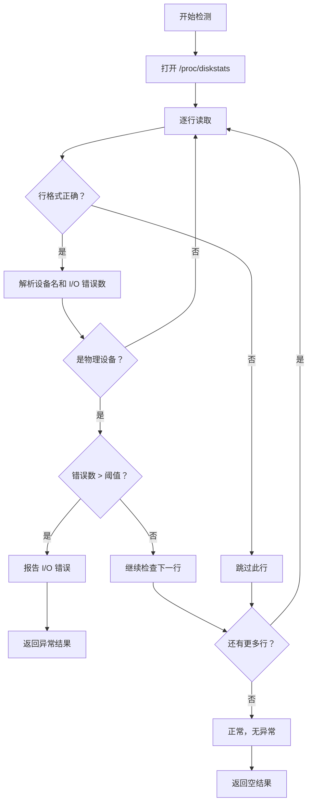

# 磁盘检测器

## 1. 概述

磁盘检测器负责检测磁盘相关的异常情况，包括 I/O 错误、磁盘故障等问题。

**检测对象**：磁盘设备和 I/O 统计
**检测器数量**：2 个（1 个功能检测器 + 1 个示例检测器）
**特殊考虑**：解析 /proc/diskstats，注意设备过滤

## 2. 检测器列表

| 检测器 | 检测项名称 | 异常级别 | 说明 |
|--------|-----------|---------|------|
| disk_io_error | disk_io_error | warning | 磁盘 I/O 错误 |
| disk_example | disk_example | - | 示例模板 |

## 3. 检测器详解

### 3.1 disk_io_error

**功能**：检测磁盘 I/O 错误计数

**实现文件**：[disk_io_error_detector.go](https://github.com/zhaojunjie/baize-monitor/blob/main/internal/agent/anomaly/disk/disk_io_error_detector.go)

#### 检测逻辑流程



#### /proc/diskstats 格式

```
# 字段说明（共 14 个字段）
 1. 主设备号
 2. 次设备号
 3. 设备名称
 4. 读完成次数
 5. 读合并次数
 6. 读扇区数
 7. 读耗时（毫秒）
 8. 写完成次数
 9. 写合并次数
10. 写扇区数
11. 写耗时（毫秒）
12. 正在处理的 I/O 数
13. I/O 总耗时（毫秒）
14. I/O 错误计数 ← 检测器使用此字段
```

**示例数据**：
```
   8       0 sda 1000 0 5000 100 2000 0 10000 200 0 50 300 150
   8      16 sdb 500 0 2500 50 1000 0 5000 100 0 25 150 200
```

#### 检测场景

**场景 1：磁盘 I/O 错误累积**
- **现象**：磁盘出现读写错误，数量超过阈值（默认 100）
- **可能原因**：
  - 磁盘老化
  - 坏道
  - 连接问题（SATA 线松动）
  - 磁盘控制器故障

**场景 2：特定设备错误**
- **现象**：某个特定磁盘设备错误率高
- **可能原因**：
  - 该磁盘硬件故障
  - 该磁盘负载过高
  - 该磁盘固件问题

#### 返回数据示例

```json
{
  "check_type": "disk",
  "check_item": "disk_io_error",
  "success": false,
  "level": "warning",
  "message": "Disk I/O errors detected",
  "extra_data": {
    "device": "sda",
    "io_errors": 150,
    "threshold": 100,
    "issue": "accumulated_io_errors"
  },
  "checked_at": "2024-01-01T10:00:00Z"
}
```

### 3.2 disk_example

**功能**：示例检测器模板

**实现文件**：[example_detector.go](https://github.com/zhaojunjie/baize-monitor/blob/main/internal/agent/anomaly/disk/example_detector.go)

**用途**：
- 作为开发新磁盘检测器的参考
- 展示检测器的标准结构
- 提供最佳实践示例

## 4. 数据源

### 4.1 /proc/diskstats

**主要数据源**：磁盘 I/O 统计信息

```go
file, err := os.Open("/proc/diskstats")
if err != nil {
    return request.AnomalyResult{}, err
}
defer file.Close()

scanner := bufio.NewScanner(file)
for scanner.Scan() {
    line := scanner.Text()
    fields := strings.Fields(line)
    
    if len(fields) >= 14 {
        device := fields[2]
        ioErrors, _ := strconv.ParseInt(fields[13], 10, 64)
        // 检查错误数
    }
}
```

### 4.2 /sys/block/*/stat

**备用数据源**：块设备统计信息

```go
// 读取磁盘统计信息
stat, _ := os.ReadFile("/sys/block/sda/stat")
// 格式与 /proc/diskstats 类似
```

### 4.3 系统命令

**调试工具**：
```bash
# 查看磁盘 I/O 统计
cat /proc/diskstats

# 查看磁盘使用情况
lsblk

# 查看磁盘 I/O 性能
iostat -x 1 5

# 查看磁盘 SMART 信息（需要 smartmontools）
sudo smartctl -a /dev/sda
```

## 5. 扩展示例

### 5.1 磁盘 SMART 错误检测器

**功能**：检测磁盘 SMART 健康状态

**实现思路**：
1. 执行 `smartctl -a /dev/sdX`
2. 解析 SMART 健康状态
3. 检查预故障警告
4. 检测重映射扇区数

**伪代码**：
```go
func (d *diskSmartDetector) Detect() (request.AnomalyResult, error) {
    // 1. 执行 smartctl
    cmd := exec.Command("smartctl", "-a", "/dev/sda")
    output, _ := cmd.Output()
    
    // 2. 检查 SMART 健康状态
    if strings.Contains(string(output), "SMART Health Status: FAILED") {
        return utils.CreateAnomalyResult(
            models.CheckTypeDisk,
            "disk_smart",
            models.AnomalyLevelCritical,
            "Disk SMART health check failed",
            map[string]interface{}{
                "device": "/dev/sda",
                "issue":  "smart_failure",
            },
        ), nil
    }
    
    // 3. 检查重映射扇区
    // ...
    
    return request.AnomalyResult{}, nil
}
```

### 5.2 磁盘使用率检测器

**功能**：检测磁盘空间不足

**实现思路**：
1. 使用 `syscall.Statfs` 获取磁盘空间信息
2. 计算使用率
3. 检查是否超过阈值

### 5.3 磁盘 I/O 延迟检测器

**功能**：检测读写延迟异常

**实现思路**：
1. 读取 `/proc/diskstats` 的读/写耗时字段
2. 计算平均延迟
3. 检查延迟是否过高

## 6. 调试方法

### 6.1 查看磁盘统计

```bash
# 查看磁盘 I/O 统计
cat /proc/diskstats

# 查看磁盘使用情况
lsblk

# 查看磁盘 I/O 性能
iostat -x 1 5

# 查看磁盘 SMART 信息
sudo smartctl -a /dev/sda
```

### 6.2 测试检测器

```go
package disk

import (
    "testing"
    "log"
)

func TestDiskIOErrorDetector(t *testing.T) {
    detector := &diskIOErrorDetector{
        errorThreshold: 100,
    }
    
    result, err := detector.Detect()
    if err != nil {
        t.Errorf("Detect() error = %v", err)
    }
    
    log.Printf("Result: %+v", result)
}
```

### 6.3 手动测试

```go
detector := &diskIOErrorDetector{
    errorThreshold: 50,
}

result, err := detector.Detect()
if err != nil {
    log.Printf("Error: %v", err)
}

if result.Success {
    log.Println("No anomaly detected")
} else {
    log.Printf("Anomaly: %s - %s", result.Level, result.Message)
    log.Printf("Extra: %+v", result.ExtraData)
}
```

## 7. 最佳实践

### 7.1 文件处理

**✅ 及时关闭文件**：
```go
diskstats, err := os.Open("/proc/diskstats")
if err != nil {
    return request.AnomalyResult{}, err
}
defer diskstats.Close()  // 确保关闭

// 使用 bufio.Scanner 高效读取
scanner := bufio.NewScanner(diskstats)
for scanner.Scan() {
    line := scanner.Text()
    // 处理每一行
}
```

### 7.2 数据验证

**✅ 验证字段数量**：
```go
fields := strings.Fields(line)
if len(fields) < 14 {
    continue  // 跳过格式不正确的行
}

// ✅ 安全的类型转换
ioErrors, err := strconv.ParseInt(fields[13], 10, 64)
if err != nil {
    continue  // 解析失败则跳过
}
```

### 7.3 设备过滤

**✅ 只监控物理设备**：
```go
device := fields[2]
if strings.HasPrefix(device, "loop") ||
   strings.HasPrefix(device, "ram") {
    continue  // 跳过虚拟设备
}
```

## 8. 故障排查

### 8.1 无法读取 /proc/diskstats

**问题**：权限不足或文件不存在

**解决方案**：
```go
diskstats, err := os.Open("/proc/diskstats")
if err != nil {
    // 记录错误并返回
    return request.AnomalyResult{}, err
}
```

### 8.2 解析错误

**问题**：输出格式不符合预期

**调试**：
```go
log.Printf("Raw line: %s", line)
log.Printf("Fields count: %d", len(fields))

// 添加更详细的错误信息
ioErrors, err := strconv.ParseInt(fields[13], 10, 64)
if err != nil {
    log.Printf("Parse error for field 13: %s, value: %s", 
               err, fields[13])
    continue
}
```

### 8.3 阈值设置不合理

**问题**：阈值太低导致误报，或太高导致漏报

**建议**：
- 初始值：100
- 根据实际环境调整
- 考虑磁盘类型（SSD vs HDD）
- 考虑工作负载

## 相关文档

- [检测器总览](../README.md)
- [接口规范](../interface.md)
- [类型和分级](../types.md)
- [CPU 检测器](cpu.md)
- [内存检测器](memory.md)
- [网络检测器](network.md)
