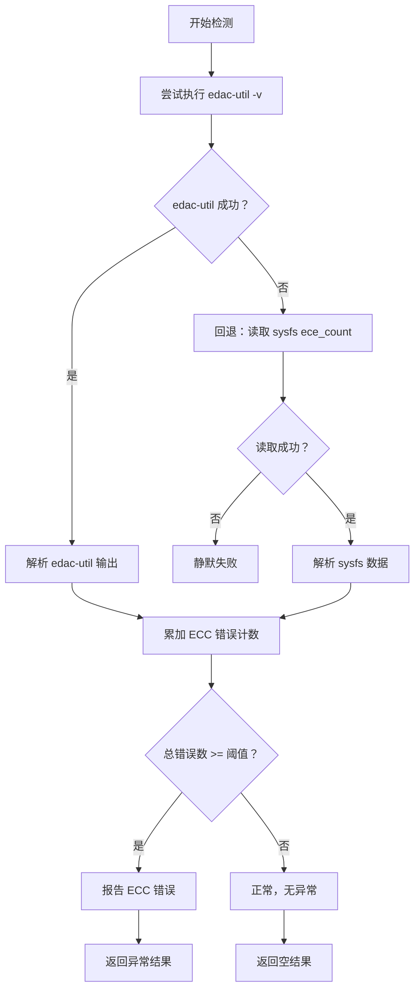

# 内存检测器

## 1. 概述

内存检测器负责检测内存相关的异常情况，包括 ECC 错误、内存故障等问题。

**检测对象**：系统内存和 ECC 错误
**检测器数量**：2 个（1 个功能检测器 + 1 个示例检测器）
**特殊考虑**：需要 edac 工具支持，提供回退方案

## 2. 检测器列表

| 检测器 | 检测项名称 | 异常级别 | 说明 |
|--------|-----------|---------|------|
| memory_ecc_error | memory_ecc_error | warning | ECC 可纠正错误 |
| memory_example | memory_example | - | 示例模板 |

## 3. 检测器详解

### 3.1 memory_ecc_error

**功能**：检测内存 ECC（Error Correction Code）可纠正错误

**实现文件**：[memory_ecc_error_detector.go](https://github.com/zhaojunjie/baize-monitor/blob/main/internal/agent/anomaly/memory/memory_ecc_error_detector.go)

#### 检测逻辑流程



#### 检测场景

**场景 1：ECC 错误累积**
- **现象**：内存出现可纠正的错误，数量超过阈值
- **可能原因**：
  - 内存老化
  - 电磁干扰
  - 硬件故障前兆
  - 内存质量问题

**场景 2：内存控制器错误**
- **现象**：内存控制器报告错误
- **可能原因**：
  - 控制器故障
  - 主板问题
  - 电压不稳定

#### 返回数据示例

```json
{
  "check_type": "memory",
  "check_item": "memory_ecc_error",
  "success": false,
  "level": "warning",
  "message": "Memory ECC correctable errors detected",
  "extra_data": {
    "total_ecc_errors": 150,
    "threshold": 100,
    "issue": "accumulated_ecc_errors"
  },
  "checked_at": "2024-01-01T10:00:00Z"
}
```

#### 依赖的数据源

**edac-util 工具**（优先）：
- 命令：`edac-util -v`
- 安装：`apt install edac-utils` 或 `yum install edac-utils`
- 输出：内存错误统计信息

**sysfs 回退方案**（备用）：
- 路径：`/sys/devices/system/edac/mc/mc*/ece_count`
- 优点：无需额外工具
- 缺点：部分系统可能不支持

### 3.2 memory_example

**功能**：示例检测器模板

**实现文件**：[example_detector.go](https://github.com/zhaojunjie/baize-monitor/blob/main/internal/agent/anomaly/memory/example_detector.go)

**用途**：
- 作为开发新内存检测器的参考
- 展示检测器的标准结构
- 提供最佳实践示例

## 4. 数据源

### 4.1 edac-util 工具

**推荐方式**：使用 edac-util 获取内存错误信息

```go
cmd := exec.Command("edac-util", "-v")
output, err := cmd.Output()
if err != nil {
    // 回退到 sysfs
}
```

**输出解析**：
```
EDAC MC0: 150 ecc_correctable_errors
EDAC MC1: 20 ecc_correctable_errors
```

### 4.2 sysfs 文件系统

**备用方式**：直接读取 sysfs

```go
files, _ := filepath.Glob("/sys/devices/system/edac/mc/mc*/ece_count")
for _, file := range files {
    data, _ := os.ReadFile(file)
    // 解析错误计数
}
```

### 4.3 /proc/meminfo

**内存信息**：
```go
file, _ := os.Open("/proc/meminfo")
defer file.Close()

scanner := bufio.NewScanner(file)
for scanner.Scan() {
    line := scanner.Text()
    // 解析 MemTotal, MemFree, MemAvailable 等
}
```

常用字段：
- `MemTotal`: 总内存
- `MemFree`: 空闲内存
- `MemAvailable`: 可用内存
- `Buffers`: 缓冲区
- `Cached`: 缓存
- `SwapTotal`: 交换空间总计

### 4.4 系统命令

**调试工具**：
```bash
# 查看内存使用情况
free -h

# 查看详细内存信息
cat /proc/meminfo

# 查看 ECC 错误（如果有）
sudo edac-util -v

# 查看内存硬件信息
sudo dmidecode -t memory
```

## 5. 扩展示例

### 5.1 内存使用率检测器

**功能**：检测内存使用率是否过高

**实现思路**：
1. 读取 `/proc/meminfo`
2. 计算使用率：`(MemTotal - MemAvailable) / MemTotal * 100`
3. 检查是否超过阈值
4. 返回异常结果

**伪代码**：
```go
func (d *memoryUsageDetector) Detect() (request.AnomalyResult, error) {
    // 1. 读取 /proc/meminfo
    // 2. 解析 MemTotal 和 MemAvailable
    // 3. 计算使用率
    usagePercent := (memTotal - memAvailable) / memTotal * 100
    
    // 4. 检查阈值
    if usagePercent > d.threshold {
        return utils.CreateAnomalyResult(
            models.CheckTypeMemory,
            "memory_usage",
            models.AnomalyLevelWarning,
            "Memory usage is too high",
            map[string]interface{}{
                "usage_percent": usagePercent,
                "threshold": d.threshold,
            },
        ), nil
    }
    return request.AnomalyResult{}, nil
}
```

### 5.2 Swap 使用率检测器

**功能**：检测 Swap 使用是否频繁

**实现思路**：
1. 读取 `/proc/meminfo` 中的 SwapTotal 和 SwapFree
2. 计算 Swap 使用率
3. 检查是否超过阈值

### 5.3 NUMA 节点不平衡检测器

**功能**：检测 NUMA 架构下内存使用不均

**实现思路**：
1. 读取 `/sys/devices/system/node/node*/meminfo`
2. 比较各节点的内存使用情况
3. 检测是否存在显著不平衡

## 6. 调试方法

### 6.1 查看内存信息

```bash
# 查看内存使用情况
free -h

# 查看详细内存信息
cat /proc/meminfo

# 查看 ECC 错误
sudo edac-util -v

# 查看内存硬件信息
sudo dmidecode -t memory
```

### 6.2 测试检测器

```go
package memory

import (
    "testing"
    "log"
)

func TestMemoryECCErrorDetector(t *testing.T) {
    detector := &memoryECCErrorDetector{
        errorThreshold: 1,
    }
    
    result, err := detector.Detect()
    if err != nil {
        t.Errorf("Detect() error = %v", err)
    }
    
    log.Printf("Result: %+v", result)
}
```

### 6.3 手动测试

```go
detector := &memoryECCErrorDetector{
    errorThreshold: 10,
}

result, err := detector.Detect()
if err != nil {
    log.Printf("Error: %v", err)
}

if result.Success {
    log.Println("No anomaly detected")
} else {
    log.Printf("Anomaly: %s - %s", result.Level, result.Message)
    log.Printf("Extra: %+v", result.ExtraData)
}
```

## 7. 最佳实践

### 7.1 命令回退策略

**✅ 推荐**：提供回退方案
```go
// 优先使用 edac-util
cmd := exec.Command("edac-util", "-v")
output, err := cmd.Output()

// 回退到 sysfs
if err != nil {
    cmd = exec.Command("cat", "/sys/devices/system/edac/mc/mc*/ece_count")
    output, err = cmd.Output()
    if err != nil {
        return request.AnomalyResult{}, nil  // 静默失败
    }
}
```

### 7.2 数据解析

**✅ 安全解析**：
```go
scanner := bufio.NewScanner(strings.NewReader(string(output)))
for scanner.Scan() {
    line := scanner.Text()
    if strings.Contains(line, "ecc_correctable_errors") {
        parts := strings.Fields(line)
        if len(parts) > 0 {
            // 安全的类型转换
            if count, err := strconv.Atoi(parts[len(parts)-1]); err == nil {
                totalErrors += count
            }
        }
    }
}
```

### 7.3 阈值设置

**✅ 可配置的阈值**：
```go
type memoryECCErrorDetector struct {
    errorThreshold int  // 可配置
}

func init() {
    RegisterDetector(&memoryECCErrorDetector{
        errorThreshold: 1,  // 默认值
    })
}
```

## 8. 故障排查

### 8.1 edac-util 不可用

**问题**：系统没有安装 edac-util

**解决方案**：
1. 安装：`apt install edac-utils` 或 `yum install edac-utils`
2. 使用回退方案：读取 `/sys/devices/system/edac/mc/mc*/ece_count`
3. 静默失败：如果系统不支持 EDAC，不报告错误

### 8.2 权限问题

**问题**：读取 sysfs 文件需要权限

**解决方案**：
```go
// 尝试读取，如果失败则静默处理
output, err := os.ReadFile("/sys/devices/system/edac/mc/mc0/ece_count")
if err != nil {
    return request.AnomalyResult{}, nil  // 静默失败
}
```

### 8.3 解析错误

**问题**：输出格式不符合预期

**调试**：
```go
log.Printf("Raw output: %s", string(output))

// 添加更详细的日志
scanner := bufio.NewScanner(strings.NewReader(string(output)))
for scanner.Scan() {
    line := scanner.Text()
    log.Printf("Processing line: %s", line)
    // ...
}
```

## 相关文档

- [检测器总览](../README.md)
- [接口规范](../interface.md)
- [类型和分级](../types.md)
- [CPU 检测器](cpu.md)
- [磁盘检测器](disk.md)
- [网络检测器](network.md)
