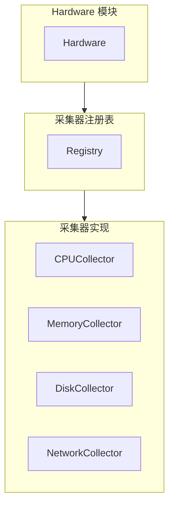

# 硬件采集模块概览

## 1. 模块职责

硬件采集模块负责采集服务器硬件信息，提供标准化的数据接口。

### 核心功能

1. **硬件信息采集** - CPU、内存、磁盘、网络接口
2. **分级采集** - 优先详细采集，失败回退通用采集
3. **数据提供** - 实现 dataProvider 接口

## 2. 架构

**说明**：
- **Hardware**：模块入口
- **Registry**：管理采集器
- **Collectors**：具体采集实现

## 3. 采集器

| 采集器 | 采集对象 | 详细文档 |
|--------|---------|---------|
| CPUCollector | CPU | [CPU 采集器](03-collectors/implementations/cpu.md) |
| MemoryCollector | 内存 | [内存采集器](03-collectors/implementations/memory.md) |
| DiskCollector | 磁盘 | [磁盘采集器](03-collectors/implementations/disk.md) |
| NetworkCollector | 网络接口 | [网络采集器](03-collectors/implementations/network.md) |

## 4. 设计特点

- **简洁架构** - 两层设计，接口最小化
- **错误隔离** - 采集器独立工作
- **跨平台** - Linux/Windows/macOS 支持

## 5. 文档导航

- **[架构详解](02-collector-architecture.md)** - 数据流、注册流程、错误处理
- **[采集器总览](03-collectors/README.md)** - 接口定义、数据结构
- **[采集策略](03-strategies.md)** - 分级采集详情
- **[扩展指南](04-extensibility.md)** - 添加新采集器
