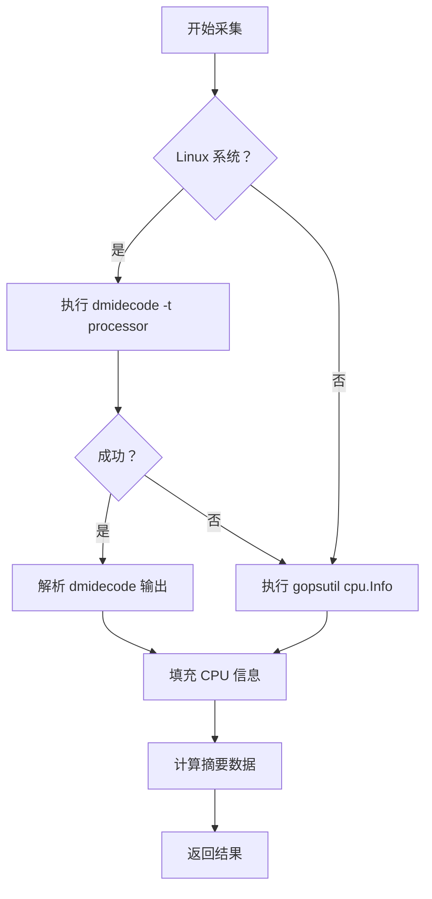

# CPU 采集器

## 1. 概述

CPU 采集器负责采集 CPU 的详细信息，包括型号、核心数、缓存等。

**采集对象**：CPU 硬件信息
**采集器**：CPUCollector
**特殊考虑**：Linux 系统优先使用 dmidecode

## 2. 采集逻辑

### 2.1 分级采集流程



### 2.2 数据源对比

| 数据源 | 需要权限 | 信息详细度 | 成功率 |
|--------|---------|----------|--------|
| dmidecode | ✅ root | ⭐⭐⭐⭐⭐ | 中 |
| gopsutil | ❌ 普通用户 | ⭐⭐⭐ | 高 |

## 3. 数据结构

### 3.1 CPURequest

```go
type CPURequest struct {
    Success bool
    Message string
    Content []CPUInfo
    Summary CPUSummary
}
```

### 3.2 CPUInfo

```go
type CPUInfo struct {
    Model       string  // 型号
    Vendor      string  // 制造商
    Family      string  // 家族
    Cores       int     // 物理核心数
    Threads     int     // 逻辑线程数
    BaseSpeed   string  // 基础频率
    CacheL1     string  // L1 缓存
    CacheL2     string  // L2 缓存
    CacheL3     string  // L3 缓存
}
```

### 3.3 CPUSummary

```go
type CPUSummary struct {
    TotalCores   int  // 总物理核心数
    TotalThreads int  // 总逻辑线程数
}
```

## 4. 采集的数据项

### 4.1 基本信息

- ✅ 型号（Model）
- ✅ 制造商（Vendor）
- ✅ 家族（Family）
- ✅ 步进（Stepping）

### 4.2 核心信息

- ✅ 物理核心数
- ✅ 逻辑线程数
- ✅ 基础频率

### 4.3 缓存信息

- ✅ L1 缓存大小
- ✅ L2 缓存大小
- ✅ L3 缓存大小

## 5. 数据源

### 5.1 dmidecode

**命令**：`dmidecode -t processor`

**输出示例**：
```
Processor Information
    Socket Designation: CPU1
    Type: Central Processor
    Family: Xeon
    Manufacturer: Intel(R) Corporation
    Max Speed: 3700 MHz
    Core Count: 8
    Thread Count: 16
```

### 5.2 gopsutil

**API**：`gopsutil/cpu.Info()`

**返回数据**：
```go
cpu.InfoStat{
    ModelName:  "Intel(R) Xeon(R) CPU",
    VendorID:   "GenuineIntel",
    Family:     "6",
    Cores:      8,
    Mhz:        3700.0,
}
```

## 6. 调试方法

### 6.1 查看 dmidecode 输出

```bash
sudo dmidecode -t processor
```

### 6.2 查看 CPU 信息

```bash
# 使用 lscpu
lscpu

# 查看 /proc/cpuinfo
cat /proc/cpuinfo

# 查看核心数
nproc
```

### 6.3 测试采集器

```go
collector := NewCPUCollector()
hardwareInfo := &hardwareRequest.HardwareInfoRequest{}

collector.Collect(hardwareInfo)

if hardwareInfo.CPUs.Success {
    log.Printf("CPU cores: %d", hardwareInfo.CPUs.Summary.TotalCores)
} else {
    log.Printf("CPU collection failed: %s", hardwareInfo.CPUs.Message)
}
```

## 7. 常见问题

### 7.1 dmidecode 失败

**原因**：
- 没有 root 权限
- dmidecode 未安装

**解决方案**：
- 使用 sudo 运行
- 安装 dmidecode：`apt install dmidecode`
- 自动回退到 gopsutil

### 7.2 核心数不匹配

**原因**：
- 虚拟化环境限制
- BIOS 设置禁用部分核心

**解决方案**：
- 检查 BIOS 设置
- 确认虚拟化配置

## 8. 扩展示例

### 8.1 添加频率监控

```go
func (c *CPUCollector) collectFrequency() string {
    freq, _ := gopsutilcpu.Frequency()
    return fmt.Sprintf("%.2f GHz", freq.Current/1000)
}
```

### 8.2 添加温度监控

```go
func (c *CPUCollector) collectTemperature() int {
    // 读取 /sys/class/thermal/thermal_zone*/temp
    // 返回温度值
}
```

## 相关文档

- [采集器总览](../README.md)
- [采集策略](../../03-strategies.md)
- [内存采集器](memory.md)
- [磁盘采集器](disk.md)
- [网络采集器](network.md)
