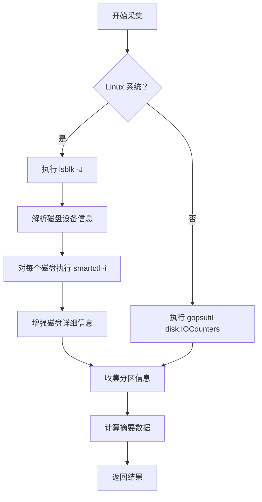

# 磁盘采集器

## 1. 概述

磁盘采集器负责采集服务器磁盘的详细信息，包括设备信息、型号、类型、分区信息等。

**采集对象**：磁盘硬件信息  
**采集器**：DiskCollector  
**特殊考虑**：Linux 系统使用 lsblk + smartctl 获取详细信息

## 2. 采集逻辑

### 2.1 分级采集流程



### 2.2 数据源对比

| 数据源 | 需要权限 | 信息详细度 | 成功率 |
|--------|---------|----------|--------|
| lsblk + smartctl | ✅ root | ⭐⭐⭐⭐⭐ | 高 |
| gopsutil | ❌ 普通用户 | ⭐⭐ | 高 |

## 3. 数据结构

### 3.1 DiskRequest

```go
type DiskRequest struct {
    Success         bool
    Message         string
    Content         []DiskInfo           // 磁盘详细信息
    Summary         DiskSummary          // 摘要统计
    TotalPartitions int                  // 分区总数
}
```

### 3.2 DiskInfo

```go
type DiskInfo struct {
    Success      bool                // 采集是否成功
    Message      string              // 错误信息
    Device       string              // 设备路径（/dev/sda）
    Size         int64               // 容量（字节）
    Model        string              // 型号
    Type         string              // 类型（HDD/SSD）
    SerialNumber string              // 序列号
    Firmware     string              // 固件版本
    RPM          int                 // 转速（HDD）
    Manufacturer string              // 制造商
    Product      string              // 产品名
    Vendor       string              // 供应商
    Partitions   []DiskPartitionInfo // 分区信息
}
```

### 3.3 DiskPartitionInfo

```go
type DiskPartitionInfo struct {
    Success    bool   // 采集是否成功
    Message    string // 错误信息
    Device     string // 分区设备（/dev/sda1）
    DiskDevice string // 所属磁盘（/dev/sda）
    Size       int64  // 分区大小（字节）
    Type       string // 分区类型
    Filesystem string // 文件系统类型
    Label      string // 标签
    IsBootable bool   // 是否可启动
}
```

### 3.4 DiskSummary

```go
type DiskSummary struct {
    TotalCount     int   // 磁盘总数
    TotalSize      int64 // 总容量（字节）
    SSDCount       int   // SSD 数量
    HDDCount       int   // HDD 数量
    TotalPartitions int  // 分区总数
}
```

## 4. 采集的数据项

### 4.1 磁盘基本信息

- ✅ 设备路径
- ✅ 容量大小
- ✅ 型号
- ✅ 类型（HDD/SSD）
- ✅ 序列号

### 4.2 磁盘详细信息

- ✅ 制造商
- ✅ 固件版本
- ✅ 转速（HDD）
- ✅ 分区信息

### 4.3 分区信息

- ✅ 分区设备
- ✅ 分区大小
- ✅ 文件系统类型
- ✅ 挂载点

## 5. 数据源

### 5.1 lsblk

**命令**：`lsblk -J -o NAME,SIZE,TYPE,MODEL,VENDOR,ROTA,SERIAL,WWN`

**输出示例**：
```json
{
  "blockdevices": [
    {
      "name": "sda",
      "size": "500G",
      "type": "disk",
      "model": "Samsung SSD 860",
      "vendor": "Samsung",
      "rota": false,
      "serial": "S3Z1NB0K123456"
    }
  ]
}
```

### 5.2 smartctl

**命令**：`smartctl -i /dev/sda`

**输出示例**：
```
=== START OF INFORMATION SECTION ===
Model Family:     Samsung based SSDs
Device Model:     Samsung SSD 860 EVO 500GB
Serial Number:    S3Z1NB0K123456
Firmware Version: RVT04B6Q
User Capacity:    500,107,862,016 bytes [500 GB]
Rotation Rate:    Solid State Device
```

### 5.3 gopsutil

**API**：`gopsutil/disk.IOCounters()`

**返回数据**：
```go
disk.IOCountersStat{
    "sda": {
        ReadBytes:  1234567890,
        WriteBytes: 987654321,
    }
}
```

## 6. 调试方法

### 6.1 查看磁盘信息

```bash
# 查看磁盘列表
lsblk

# 查看详细信息
sudo lsblk -o NAME,SIZE,TYPE,MODEL,VENDOR,SERIAL

# 查看磁盘使用情况
df -h
```

### 6.2 查看 S.M.A.R.T 信息

```bash
# 查看磁盘详细信息
sudo smartctl -i /dev/sda

# 查看健康状态
sudo smartctl -H /dev/sda
```

### 6.3 测试采集器

```go
collector := NewDiskCollector()
hardwareInfo := &hardwareRequest.HardwareInfoRequest{}

collector.Collect(hardwareInfo)

if hardwareInfo.Disks.Success {
    log.Printf("Total disks: %d", hardwareInfo.Disks.Summary.TotalCount)
    log.Printf("Total size: %d GB", hardwareInfo.Disks.Summary.TotalSize / 1024 / 1024 / 1024)
    log.Printf("SSD: %d, HDD: %d", hardwareInfo.Disks.Summary.SSDCount, hardwareInfo.Disks.Summary.HDDCount)
} else {
    log.Printf("Disk collection failed: %s", hardwareInfo.Disks.Message)
}
```

## 7. 常见问题

### 7.1 smartctl 失败

**原因**：
- smartctl 未安装
- 没有权限访问设备

**解决方案**：
- 安装 smartmontools：`apt install smartmontools`
- 使用 sudo 运行
- 不影响基础信息采集（lsblk 仍然可用）

### 7.2 磁盘类型识别错误

**原因**：
- ROTA 字段不准确
- 某些 SSD 被识别为 HDD

**解决方案**：
- 结合 smartctl 的 Rotation Rate 字段判断
- SSD 显示为 "Solid State Device"

## 8. 扩展示例

### 8.1 添加磁盘健康度

```go
func (d *DiskCollector) collectHealth(device string) (string, error) {
    cmd := exec.Command("smartctl", "-H", device)
    output, err := cmd.Output()
    if err != nil {
        return "", err
    }
    
    if strings.Contains(string(output), "PASSED") {
        return "healthy", nil
    }
    return "warning", nil
}
```

### 8.2 添加磁盘使用率

```go
func (d *DiskCollector) collectUsage(mountpoint string) (float64, error) {
    usage, err := disk.Usage(mountpoint)
    if err != nil {
        return 0, err
    }
    return usage.UsedPercent, nil
}
```

## 相关文档

- [采集器总览](../README.md)
- [采集策略](../../03-strategies.md)
- [CPU 采集器](cpu.md)
- [内存采集器](memory.md)
- [网络采集器](network.md)
