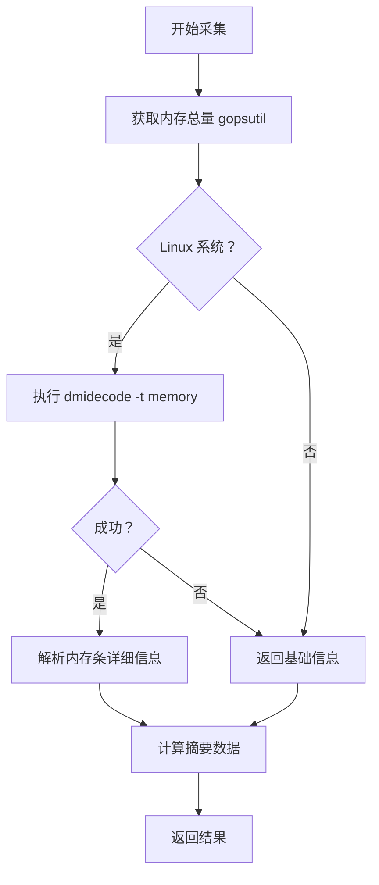

# 内存采集器

## 1. 概述

内存采集器负责采集服务器内存的详细信息，包括总容量、类型、内存条信息等。

**采集对象**：内存硬件信息  
**采集器**：MemoryCollector  
**特殊考虑**：Linux 系统优先使用 dmidecode

## 2. 采集逻辑

### 2.1 分级采集流程



### 2.2 数据源对比

| 数据源 | 需要权限 | 信息详细度 | 成功率 |
|--------|---------|----------|--------|
| dmidecode | ✅ root | ⭐⭐⭐⭐⭐ | 中 |
| gopsutil | ❌ 普通用户 | ⭐⭐ | 高 |

## 3. 数据结构

### 3.1 MemoryRequest

```go
type MemoryRequest struct {
    Success bool
    Message string
    Content []MemoryModuleInfo  // 内存条详细信息
    Summary MemorySummary       // 摘要统计
}
```

### 3.2 MemoryModuleInfo

```go
type MemoryModuleInfo struct {
    Success      bool   // 采集是否成功
    Message      string // 错误信息
    Slot         string // 插槽位置
    Size         int64  // 容量（字节）
    Type         string // 类型（DDR3/DDR4 等）
    Speed        string // 频率
    Manufacturer string // 制造商
    SerialNumber string // 序列号
    PartNumber   string // 部件号
}
```

### 3.3 MemorySummary

```go
type MemorySummary struct {
    TotalSize  int64  // 总容量（字节）
    Type       string // 内存类型
    Speed      string // 内存速度
    TotalSlots int    // 总插槽数
    UsedSlots  int    // 已用插槽数
}
```

## 4. 采集的数据项

### 4.1 基本信息

- ✅ 总容量
- ✅ 内存类型（DDR3/DDR4 等）
- ✅ 内存速度

### 4.2 内存条信息

- ✅ 插槽位置
- ✅ 单条容量
- ✅ 制造商
- ✅ 序列号
- ✅ 部件号

## 5. 数据源

### 5.1 dmidecode

**命令**：`dmidecode -t memory`

**输出示例**：
```
Memory Device
    Locator: DIMM_A1
    Size: 16384 MB
    Type: DDR4
    Speed: 2666 MT/s
    Manufacturer: Samsung
    Serial Number: 12345678
    Part Number: M393A2K40BB1-CTD
```

### 5.2 gopsutil

**API**：`gopsutil/mem.VirtualMemory()`

**返回数据**：
```go
mem.VirtualMemoryStat{
    Total: 17179869184,  // 总内存（字节）
    Used:  8589934592,
    Free:  8589934592,
}
```

## 6. 调试方法

### 6.1 查看 dmidecode 输出

```bash
sudo dmidecode -t memory
```

### 6.2 查看内存信息

```bash
# 查看总内存
free -h

# 查看内存详情
cat /proc/meminfo

# 查看内存条信息（需要 root）
sudo dmidecode -t memory
```

### 6.3 测试采集器

```go
collector := NewMemoryCollector()
hardwareInfo := &hardwareRequest.HardwareInfoRequest{}

collector.Collect(hardwareInfo)

if hardwareInfo.Memory.Success {
    log.Printf("Total memory: %d GB", hardwareInfo.Memory.Summary.TotalSize / 1024 / 1024 / 1024)
    log.Printf("Memory type: %s", hardwareInfo.Memory.Summary.Type)
    log.Printf("Used slots: %d", hardwareInfo.Memory.Summary.UsedSlots)
} else {
    log.Printf("Memory collection failed: %s", hardwareInfo.Memory.Message)
}
```

## 7. 常见问题

### 7.1 dmidecode 失败

**原因**：
- 没有 root 权限
- dmidecode 未安装

**解决方案**：
- 使用 sudo 运行
- 安装 dmidecode：`apt install dmidecode`
- 自动回退到 gopsutil（只返回总容量）

### 7.2 内存信息显示 Unknown

**原因**：
- 虚拟化环境限制
- BIOS 信息不完整

**解决方案**：
- 检查 BIOS 设置
- 确认硬件支持

## 8. 扩展示例

### 8.1 添加内存使用率

```go
func (m *MemoryCollector) collectUsage() (float64, error) {
    memInfo, err := mem.VirtualMemory()
    if err != nil {
        return 0, err
    }
    return memInfo.UsedPercent, nil
}
```

### 8.2 添加 ECC 检测

```go
func (m *MemoryCollector) detectECC(output string) bool {
    // 解析 dmidecode 输出中的 ECC 信息
    return strings.Contains(output, "ECC")
}
```

## 相关文档

- [采集器总览](../README.md)
- [采集策略](../../03-strategies.md)
- [CPU 采集器](cpu.md)
- [磁盘采集器](disk.md)
- [网络采集器](network.md)
