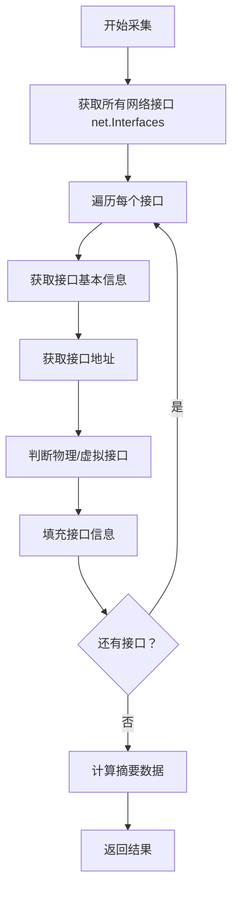

# 网络采集器

## 1. 概述

网络采集器负责采集服务器网络接口的详细信息，包括接口名称、MAC 地址、IP 地址、速度等。

**采集对象**：网络接口硬件信息  
**采集器**：NetworkCollector  
**特殊考虑**：跨平台支持，使用标准库 net.Interfaces

## 2. 采集逻辑

### 2.1 采集流程



### 2.2 数据源

| 数据源 | 需要权限 | 信息详细度 | 成功率 |
|--------|---------|----------|--------|
| net.Interfaces | ❌ 普通用户 | ⭐⭐⭐ | 高 |
| /sys/class/net | ❌ 普通用户 | ⭐⭐⭐⭐ | 高（仅 Linux） |
| ethtool | ✅ root | ⭐⭐⭐⭐⭐ | 中（仅 Linux） |

## 3. 数据结构

### 3.1 NetworkInterfaceRequest

```go
type NetworkInterfaceRequest struct {
    Success bool
    Message string
    Content []NetworkInterfaceInfo  // 接口详细信息
    Summary NetworkInterfaceSummary // 摘要统计
}
```

### 3.2 NetworkInterfaceInfo

```go
type NetworkInterfaceInfo struct {
    Success      bool   // 采集是否成功
    Message      string // 错误信息
    Name         string // 接口名称（eth0）
    MACAddress   string // MAC 地址
    IPAddress    string // IPv4 地址
    SubnetMask   string // 子网掩码
    Gateway      string // 网关
    Speed        string // 连接速度
    Duplex       string // 双工模式
    MTU          int    // 最大传输单元
    Type         string // 接口类型
    IsVirtual    bool   // 是否虚拟接口
    Manufacturer string // 制造商
    Driver       string // 驱动程序
    PCIAddress   string // PCI 地址
}
```

### 3.3 NetworkInterfaceSummary

```go
type NetworkInterfaceSummary struct {
    TotalCount    int  // 接口总数
    PhysicalCount int  // 物理接口数
    VirtualCount  int  // 虚拟接口数
}
```

## 4. 采集的数据项

### 4.1 基本信息

- ✅ 接口名称
- ✅ MAC 地址
- ✅ IP 地址
- ✅ 子网掩码
- ✅ MTU

### 4.2 接口分类

- ✅ 物理接口
- ✅ 虚拟接口（Docker、网桥等）

### 4.3 高级信息（需要 root）

- ⚠️ 连接速度
- ⚠️ 双工模式
- ⚠️ 驱动程序
- ⚠️ PCI 地址

## 5. 数据源

### 5.1 net.Interfaces

**API**：`net.Interfaces()`

**返回数据**：
```go
[]net.Interface{
    {
        Index:        1,
        MTU:          1500,
        Name:         "eth0",
        HardwareAddr: net.HardwareAddr{0x00, 0x1a, 0x2b, 0x3c, 0x4d, 0x5e},
        Flags:        net.FlagUp | net.FlagBroadcast,
    }
}
```

### 5.2 net.Interface.Addrs

**API**：`iface.Addrs()`

**返回数据**：
```go
[]net.Addr{
    &net.IPNet{
        IP:   net.IP{192, 168, 1, 100},
        Mask: net.IPMask{255, 255, 255, 0},
    }
}
```

### 5.3 /sys/class/net（Linux）

**路径**：`/sys/class/net/<interface>/`

**可获取信息**：
- `speed`: 连接速度
- `duplex`: 双工模式
- `address`: MAC 地址
- `mtu`: MTU 值

## 6. 调试方法

### 6.1 查看网络接口

```bash
# 查看所有接口
ip link show

# 查看 IP 地址
ip addr show

# 查看路由
ip route show
```

### 6.2 查看接口详细信息

```bash
# 查看接口状态
cat /sys/class/net/eth0/speed
cat /sys/class/net/eth0/duplex

# 使用 ethtool（需要 root）
sudo ethtool eth0
```

### 6.3 测试采集器

```go
collector := NewNetworkCollector()
hardwareInfo := &hardwareRequest.HardwareInfoRequest{}

collector.Collect(hardwareInfo)

if hardwareInfo.NetworkInterfaces.Success {
    log.Printf("Total interfaces: %d", hardwareInfo.NetworkInterfaces.Summary.TotalCount)
    log.Printf("Physical: %d, Virtual: %d", 
        hardwareInfo.NetworkInterfaces.Summary.PhysicalCount,
        hardwareInfo.NetworkInterfaces.Summary.VirtualCount)
    
    for _, iface := range hardwareInfo.NetworkInterfaces.Content {
        log.Printf("Interface: %s, IP: %s, MAC: %s", 
            iface.Name, iface.IPAddress, iface.MACAddress)
    }
} else {
    log.Printf("Network collection failed: %s", hardwareInfo.NetworkInterfaces.Message)
}
```

## 7. 常见问题

### 7.1 无法获取 IP 地址

**原因**：
- 接口未配置 IP
- 接口处于 DOWN 状态

**解决方案**：
- 检查接口状态：`ip link show`
- 配置 IP 地址或启用接口

### 7.2 虚拟接口识别

**虚拟接口特征**：
- Docker 接口：`docker0`, `veth*`
- 网桥接口：`br-*`
- 容器接口：`eth*`（容器内）

**识别方法**：
```go
if strings.Contains(iface.Name, "docker") ||
   strings.Contains(iface.Name, "veth") ||
   strings.Contains(iface.Name, "br-") {
    networkInterface.IsVirtual = true
}
```

### 7.3 无法获取速度信息

**原因**：
- 没有 root 权限
- 无线接口不支持
- 虚拟化环境

**解决方案**：
- 使用 sudo 运行
- 接受速度信息为 "Unknown"
- 不影响基础信息采集

## 8. 扩展示例

### 8.1 添加接口统计信息

```go
func (n *NetworkCollector) collectStats(ifaceName string) (*net.InterfaceStat, error) {
    stats, err := gopsutilnet.IOCounters(true)
    if err != nil {
        return nil, err
    }
    
    for _, stat := range stats {
        if stat.Name == ifaceName {
            return &stat, nil
        }
    }
    return nil, fmt.Errorf("interface not found")
}
```

### 8.2 添加连接状态检测

```go
func (n *NetworkCollector) checkConnectivity() bool {
    // 尝试 ping 网关或 DNS
    conn, err := net.Dial("udp", "8.8.8.8:53")
    if err != nil {
        return false
    }
    defer conn.Close()
    return true
}
```

### 8.3 添加带宽信息

```go
func (n *NetworkCollector) collectBandwidth(ifaceName string) (uint64, error) {
    // 读取 /sys/class/net/<iface>/speed
    content, err := os.ReadFile(fmt.Sprintf("/sys/class/net/%s/speed", ifaceName))
    if err != nil {
        return 0, err
    }
    speed, _ := strconv.ParseUint(strings.TrimSpace(string(content)), 10, 64)
    return speed * 1000 * 1000, nil  // Mbps -> bps
}
```

## 相关文档

- [采集器总览](../README.md)
- [采集策略](../../03-strategies.md)
- [CPU 采集器](cpu.md)
- [内存采集器](memory.md)
- [磁盘采集器](disk.md)
