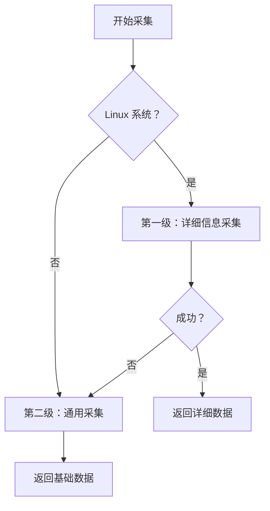

# 采集策略

## 1. 分级采集

### 策略概述

硬件采集采用**优先详细，回退通用**的分级策略。

### 第一级：详细信息采集

| 硬件类型 | 命令/数据源 | 需要权限 |
|---------|-----------|---------|
| CPU | `dmidecode -t processor` | ✅ root |
| 内存 | `dmidecode -t memory` | ✅ root |
| 磁盘 | `lsblk` + `hdparm` | ❌ 普通用户 |
| 网络 | `/sys/class/net/` + `ethtool` | ❌ 普通用户 |

**优势**：提供详细、准确的硬件信息  
**劣势**：部分命令需要 root 权限

### 第二级：通用信息采集

使用 gopsutil 库，跨平台支持

**优势**：不需要 root 权限，依赖少  
**劣势**：信息相对基础

## 2. 错误处理

### 错误隔离

每个采集器独立执行，一个失败不影响其他

### 错误记录

采集失败时，记录到对应部件的 `Success` 和 `Message` 字段

## 3. 数据源对比

| 数据源 | 需要权限 | 信息详细度 | 成功率 |
|--------|---------|----------|--------|
| dmidecode | ✅ root | ⭐⭐⭐⭐⭐ | 中 |
| lsblk | ❌ 普通用户 | ⭐⭐⭐⭐ | 高 |
| gopsutil | ❌ 普通用户 | ⭐⭐ | 高 |

## 相关文档

- [架构详解](02-collector-architecture.md) - 错误处理
- [CPU 采集器](03-collectors/implementations/cpu.md) - 数据源详情
- [内存采集器](03-collectors/implementations/memory.md) - 数据源详情
