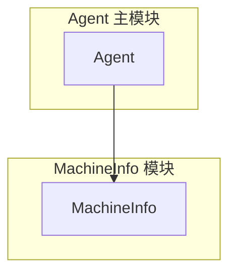

# 机器信息模块概览

## 1. 模块职责

机器信息模块负责采集机器的基本信息，包括主机名和网络接口 IP 地址。

### 核心职责
- **主机名采集** - 获取操作系统主机名
- **IP 地址采集** - 获取所有启用的网络接口 IP 地址
- **数据提供** - 实现 dataProvider 接口

## 2. 架构

## 3. 核心功能

### 主机名采集
- 使用 `os.Hostname()` 获取
- 失败时返回 "unknown"

### IP 地址采集
- 使用 `net.Interfaces()` 获取
- 只收集启用的接口
- 支持 IPv4 和 IPv6

## 4. 数据结构

MachineInfoRequest 包含：
- Success: 是否成功
- Message: 消息/错误信息
- Content: MachineInfo（主机名 + IP 地址）
- CollectedAt: 采集时间

## 5. 设计原则

### 简单直接
- 无复杂逻辑
- 无外部依赖
- 无配置项

### 错误处理
- 错误累积到 Message 字段
- 部分成功时仍返回数据

### 轻量级
- 无状态设计
- 采集快速
- 资源占用可忽略

## 6. 特点

### 功能固定
- 主机名采集
- IP 地址采集
- 无扩展需求

### 跨平台
- 使用标准库
- 支持 Linux、Windows、macOS

### 零依赖
- 只使用 Go 标准库
- 无第三方依赖

## 相关文档

- [数据采集](02-data-collection.md) - 详细的采集方法
- [Agent 架构](../../README.md) - Agent 整体架构
