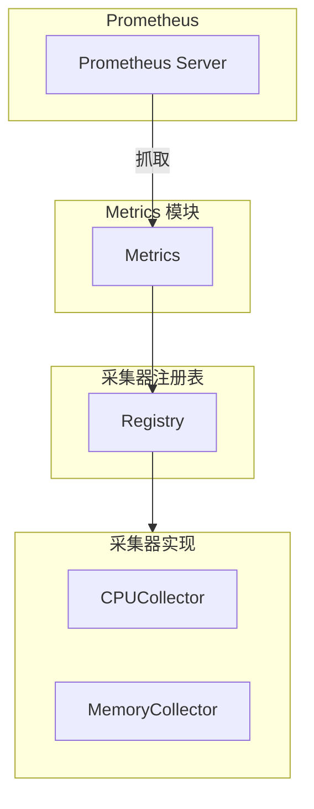

# 指标采集模块概览

## 1. 模块职责

指标采集模块负责采集系统性能指标，并通过 Prometheus Collector 接口提供给 Prometheus 抓取。

### 核心职责
- **Prometheus 集成** - 实现标准 Collector 接口
- **指标采集** - CPU、内存等系统指标
- **采集器管理** - 注册和管理采集器

## 2. 架构

## 3. 核心功能

### Prometheus 集成
- 实现 `prometheus.Collector` 接口
- 提供 `Describe()` 和 `Collect()` 方法
- 无缝集成 Prometheus

### 采集器管理
- 集中注册采集器
- 统一执行采集逻辑
- 易于扩展

### CPU 指标采集
- CPU 使用率
- 使用 gopsutil 采集

### 内存指标采集
- 内存使用率
- 总内存、已用内存、空闲内存
- 使用 gopsutil 采集

## 4. 数据结构

Metrics 包含：
- collectorRegistry: 采集器注册表

Registry 包含：
- collectors: 采集器列表

PrometheusMetricsCollector 接口：
- 继承 prometheus.Collector
- 实现 Describe() 和 Collect() 方法

## 5. 设计原则

### Prometheus 原生支持
- 实现标准 Collector 接口
- 符合 Prometheus 规范

### 插件化架构
- 采集器独立实现
- 集中注册
- 易于扩展

### 错误隔离
- 采集器错误不影响其他
- 静默失败，记录日志

### 轻量级
- 无状态设计
- 按需采集
- 资源占用低

## 6. 特点

### 标准化
- 遵循 Prometheus 规范
- 指标命名规范

### 可扩展
- 插件化架构
- 支持自定义指标

### 高性能
- 并发安全
- 采集快速
- 低延迟

## 相关文档

- [架构设计](02-architecture.md) - Prometheus 集成详解
- [采集器总览](03-collectors/README.md) - 接口和采集器列表
- [CPU 采集器](03-collectors/cpu.md) - CPU 指标采集
- [内存采集器](03-collectors/memory.md) - 内存指标采集
