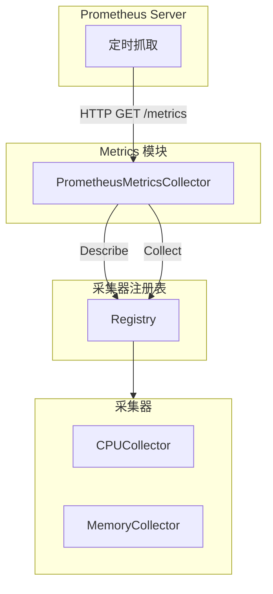

# 架构设计

## 1. 概述

指标采集模块基于 Prometheus 的 Collector 接口，实现指标的自动采集和暴露。

## 2. 架构



## 3. 代码结构

```
internal/agent/metrics/
├── metrics.go                      # 模块入口（实现 prometheus.Collector）
├── types/
│   └── collector.go                # 接口定义
├── registry/
│   └── registry.go                 # 注册表实现
└── collectors/
    ├── cpu_collector.go            # CPU 采集器
    └── memory_collector.go         # 内存采集器
```

## 4. 核心组件

### Metrics 模块

**职责**：实现 Prometheus Collector 接口

- 管理采集器注册表
- 实现 `Describe()` 方法
- 实现 `Collect()` 方法

### 采集器注册表

**职责**：管理采集器的注册和描述

- 注册采集器
- 收集所有采集器的描述符
- 执行采集器的采集逻辑

### 采集器

**职责**：实现 PrometheusMetricsCollector 接口

- 实现 `Describe()` 返回指标描述
- 实现 `Collect()` 采集指标数据

## 5. Prometheus 集成

### 实现 Collector 接口

```go
type PrometheusMetricsCollector interface {
    prometheus.Collector
}
```

### Describe 方法

返回所有指标的描述符，Prometheus 用于了解指标元数据

### Collect 方法

采集指标数据并发送到 Prometheus channel

## 6. 注册流程

1. 创建采集器实例
2. 注册到 Registry
3. Registry 注册到 Metrics
4. Metrics 注册到 Prometheus

## 7. 采集流程

1. Prometheus 定时抓取 /metrics 端点
2. Metrics 调用 Collect() 方法
3. 遍历所有采集器执行采集
4. 返回指标数据给 Prometheus

## 8. 错误处理

### 错误隔离

每个采集器独立执行，一个失败不影响其他

### 错误记录

采集失败时记录日志，不影响其他采集器

## 9. 并发安全

### 并发控制

- Registry 使用 RWMutex 保护
- 读操作无锁
- 写操作独占锁

### 采集并发

- Prometheus 并发抓取
- 采集器需要并发安全

## 相关文档

- [模块概览](01-overview.md) - 高层介绍
- [采集器总览](03-collectors/README.md) - 接口定义
- [CPU 采集器](03-collectors/cpu.md) - CPU 指标采集
- [内存采集器](03-collectors/memory.md) - 内存指标采集
