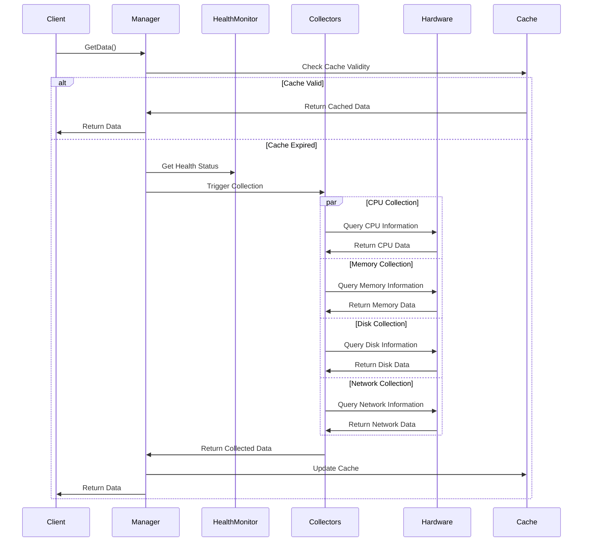
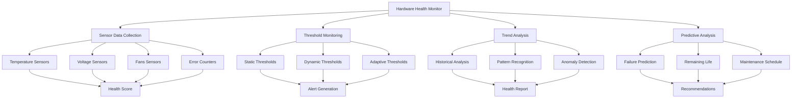

# Hardware模块设计文档

## 概述

Hardware模块负责收集和提供主机的硬件信息，包括CPU、内存、磁盘、网络设备等硬件组件的详细信息。该模块为监控平台提供硬件层面的监控数据，支持硬件健康状态监控、性能分析和容量规划。

## 架构设计

```mermaid
graph TB
    subgraph "Hardware Module"
        A[Hardware Manager] --> B[CPU Info Collector]
        A --> C[Memory Info Collector]
        A --> D[Disk Info Collector]
        A --> E[Network Info Collector]
        A --> F[Hardware Health Monitor]
        A --> G[Performance Monitor]
    end
    
    subgraph "CPU Information"
        B --> H[CPU Specifications]
        B --> I[CPU Topology]
        B --> J[CPU Performance]
        B --> K[CPU Temperature]
        B --> L[CPU Cache]
    end
    
    subgraph "Memory Information"
        C --> M[Memory Configuration]
        C --> N[Memory Topology]
        C --> O[Memory Performance]
        C --> P[Memory Health]
        C --> Q[Memory Temperature]
    end
    
    subgraph "Disk Information"
        D --> R[Disk Configuration]
        D --> S[Disk Performance]
        D --> T[Disk Health]
        D --> U[Disk Temperature]
        D --> V[Storage Topology]
    end
    
    subgraph "Network Information"
        E --> W[Network Interface]
        E --> X[Network Performance]
        E --> Y[Network Health]
        E --> Z[Network Topology]
    end
    
    subgraph "Data Interface"
        F --> AA[dataProvider Interface]
        G --> AB[Metrics Integration]
        F --> AC[Health Status]
        G --> AD[Performance Metrics]
    end
    
    subgraph "Hardware Access Layer"
        AE[Hardware Abstraction]
        AF[Platform Detection]
        AG[Driver Interface]
        AH[System Calls]
    end
    
    B --> AE
    C --> AE
    D --> AE
    E --> AE
    F --> AF
    G --> AG
    AE --> AH
    AF --> AH
    AG --> AH
```



## 核心功能

### 1. CPU信息收集
收集CPU的详细规格和性能信息：
- **基本规格**：型号、频率、核心数、线程数
- **架构信息**：指令集、缓存层次、拓扑结构
- **性能指标**：使用率、频率变化、功耗
- **健康状态**：温度、电压、错误计数
- **拓扑信息**：NUMA节点、物理封装、逻辑处理器关系

### 2. 内存信息收集
收集内存系统的配置和状态信息：
- **容量信息**：总容量、已用容量、空闲容量
- **配置信息**：内存类型、频率、通道配置
- **拓扑信息**：DIMM插槽、内存控制器、NUMA分布
- **性能指标**：带宽、延迟、错误率
- **健康监控**：温度、错误检测、ECC状态

### 3. 磁盘信息收集
收集存储设备的详细信息和状态：
- **设备信息**：型号、容量、接口类型、固件版本
- **性能指标**：读写速度、IOPS、延迟
- **健康状态**：SMART信息、错误计数、剩余寿命
- **拓扑信息**：RAID配置、存储层次、连接拓扑
- **温度监控**：设备温度、热管理状态

### 4. 网络设备信息
收集网络硬件的信息和性能：
- **接口信息**：网卡型号、速率、驱动版本
- **性能指标**：吞吐量、错误率、丢包率
- **硬件特性**：硬件卸载功能、多队列支持
- **健康状态**：链路状态、错误检测、温度
- **拓扑信息**：物理端口、虚拟接口、交换结构

### 5. 硬件健康监控
实时监控硬件健康状态：
- **传感器数据**：温度、电压、风扇转速
- **错误检测**：硬件错误、校正事件、故障预测
- **阈值监控**：超温、过压、异常状态
- **预警机制**：基于历史数据的故障预测
- **状态聚合**：综合健康评分和状态报告

## 数据模型

### CPU信息结构
```yaml
cpu_info:
  physical_cores: 8
  logical_cores: 16
  sockets: 1
  cores_per_socket: 8
  threads_per_core: 2
  architecture: "x86_64"
  vendor: "GenuineIntel"
  model: "Intel(R) Core(TM) i7-10700K CPU @ 3.80GHz"
  family: 6
  model_number: 165
  stepping: 5
  frequency: 3800
  min_frequency: 800
  max_frequency: 5100
  cache:
    l1_instruction: 32768
    l1_data: 32768
    l2: 262144
    l3: 16777216
  topology:
    - socket: 0
      cores:
        - core_id: 0
          threads: [0, 8]
          l1_cache: 32768
          l2_cache: 262144
  temperature:
    package: 45
    cores: [42, 44, 46, 43, 41, 45, 47, 44]
  health:
    status: "healthy"
    errors: 0
    throttle_events: 0
```

### 内存信息结构
```yaml
memory_info:
  total: 34359738368
  available: 28991029248
  used: 5368709120
  free: 24531046400
  cached: 8192000000
  buffered: 1024000000
  swap_total: 8589934592
  swap_free: 4294967296
  swap_used: 4294967296
  configuration:
    type: "DDR4"
    speed: 3200
    channels: 2
    voltage: 1.35
  topology:
    - slot: "DIMM_A1"
      size: 17179869184
      type: "DDR4"
      speed: 3200
      manufacturer: "Corsair"
      part_number: "CMW32GX4M2C3200C16"
      temperature: 38
      health: "healthy"
  performance:
    bandwidth_read: 25000
    bandwidth_write: 24000
    latency: 15
  health:
    ecc_errors: 0
    temperature_status: "normal"
    overall_status: "healthy"
```

### 磁盘信息结构
```yaml
disk_info:
  devices:
    - device: "/dev/sda"
      model: "Samsung SSD 860 EVO 1TB"
      size: 1000204886016
      type: "SSD"
      interface: "SATA"
      firmware: "RVT04B6Q"
      serial: "S3Z8NB0K123456"
      temperature: 35
      health:
        status: "healthy"
        smart_status: "PASSED"
        power_on_hours: 8760
        power_cycle_count: 365
        wear_leveling: 15
        spare_blocks: 100
      performance:
        read_speed: 550
        write_speed: 520
        iops_read: 98000
        iops_write: 90000
      partitions:
        - partition: "/dev/sda1"
          size: 536870912000
          filesystem: "ext4"
          mount_point: "/"
          used: 322122547200
          available: 214748364800
```

### 网络设备信息结构
```yaml
network_info:
  interfaces:
    - name: "eth0"
      type: "ethernet"
      mac_address: "00:11:22:33:44:55"
      vendor: "Intel Corporation"
      model: "I210 Gigabit Network Connection"
      driver: "igb"
      version: "5.6.0-k"
      firmware: "3.25"
      speed: 1000
      duplex: "full"
      mtu: 1500
      features:
        - "scatter-gather"
        - "tcp-segmentation-offload"
        - "generic-receive-offload"
      queues:
        tx: 4
        rx: 4
      health:
        link_status: "up"
        temperature: 55
        errors: 0
        dropped: 12
      performance:
        throughput_rx: 950
        throughput_tx: 980
        errors_rx: 0
        errors_tx: 0
```

## 数据收集流程



## 硬件健康监控

### 健康状态模型



### 健康状态等级
- **Healthy (健康)**：所有指标正常，设备运行良好
- **Warning (警告)**：某些指标接近阈值，需要关注
- **Critical (严重)**：某些指标超过阈值，需要立即处理
- **Failure (故障)**：设备出现故障，需要维修或更换

### 监控指标
- **温度监控**：CPU温度、硬盘温度、环境温度
- **电压监控**：电源电压、电池电压、信号电压
- **风扇监控**：风扇转速、风扇状态、散热效果
- **错误监控**：硬件错误、校正错误、通信错误

## 性能监控

### 性能指标收集
- **实时性能**：当前性能状态和利用率
- **历史性能**：性能趋势和历史数据
- **峰值性能**：最大性能和瓶颈识别
- **效率指标**：性能与功耗的比值

### 性能优化建议
- **瓶颈识别**：识别性能瓶颈和限制因素
- **配置优化**：提供硬件配置优化建议
- **容量规划**：基于性能数据的容量规划
- **升级建议**：硬件升级和扩展建议

## 缓存策略

### 缓存设计
- **分层缓存**：不同硬件组件使用不同的缓存策略
- **智能刷新**：基于硬件状态变化动态刷新缓存
- **增量更新**：只更新变化的硬件信息
- **缓存预热**：预测性加载可能需要的信息

### 缓存配置
```yaml
cache_config:
  cpu_info_ttl: 300s       # CPU信息缓存5分钟
  memory_info_ttl: 600s    # 内存信息缓存10分钟
  disk_info_ttl: 900s      # 磁盘信息缓存15分钟
  network_info_ttl: 300s   # 网络信息缓存5分钟
  health_status_ttl: 60s   # 健康状态缓存1分钟
  max_cache_size: 5242880  # 最大缓存大小5MB
```

## 错误处理

### 1. 硬件访问错误
- **权限问题**：处理硬件访问权限不足的情况
- **驱动问题**：处理硬件驱动不可用的情况
- **兼容性问题**：处理不同硬件平台的兼容性问题

### 2. 数据收集错误
- **传感器错误**：处理传感器数据不可用的情况
- **通信错误**：处理与硬件通信失败的情况
- **超时处理**：处理硬件响应超时的情况

### 3. 健康监控错误
- **阈值错误**：处理阈值设置不合理的情况
- **预测错误**：处理故障预测算法失败的情况
- **状态错误**：处理健康状态评估失败的情况

## 安全考虑

### 1. 硬件访问安全
- **最小权限**：使用最小权限访问硬件信息
- **安全调用**：使用安全的系统调用和接口
- **权限验证**：验证硬件访问的合法性

### 2. 数据安全
- **敏感信息保护**：不暴露敏感的硬件信息
- **数据加密**：对敏感的硬件数据进行加密
- **访问控制**：控制对硬件信息的访问权限

### 3. 系统安全
- **系统稳定性**：确保硬件信息收集不影响系统稳定性
- **资源保护**：防止硬件信息收集过度消耗资源
- **错误隔离**：隔离硬件访问错误对系统的影响

## 扩展性设计

### 1. 硬件适配
- **多平台支持**：支持不同的硬件平台
- **驱动适配**：适配不同的硬件驱动
- **接口标准化**：标准化的硬件访问接口

### 2. 新硬件支持
- **插件机制**：支持新硬件的插件扩展
- **自动发现**：自动发现和识别新硬件
- **动态加载**：动态加载新硬件的支持模块

### 3. 集成扩展
- **云集成**：与云平台的硬件信息集成
- **管理集成**：与硬件管理系统的集成
- **监控集成**：与其他监控系统的集成

## 监控和可观测性

### 内部指标
- `hardware_collection_duration_seconds` - 硬件信息收集耗时
- `hardware_collection_errors_total` - 收集错误次数
- `hardware_sensor_readings_total` - 传感器读数次数
- `hardware_health_status` - 硬件健康状态
- `hardware_temperature_celsius` - 硬件温度指标

### 健康检查
- **传感器状态**：检查传感器的工作状态
- **数据完整性**：检查硬件信息的完整性
- **访问可用性**：检查硬件访问接口的可用性
- **性能指标**：监控硬件信息收集的性能

## 相关文档

- [Agent架构设计](agent.md) - Agent整体架构
- [Metrics模块设计](metrics.md) - 指标收集模块
- [Machine Info模块](machine_info.md) - 机器信息模块
- [Anomaly模块](anomaly.md) - 异常检测模块
- [配置说明](../config/agent.yaml) - 配置文件详细说明