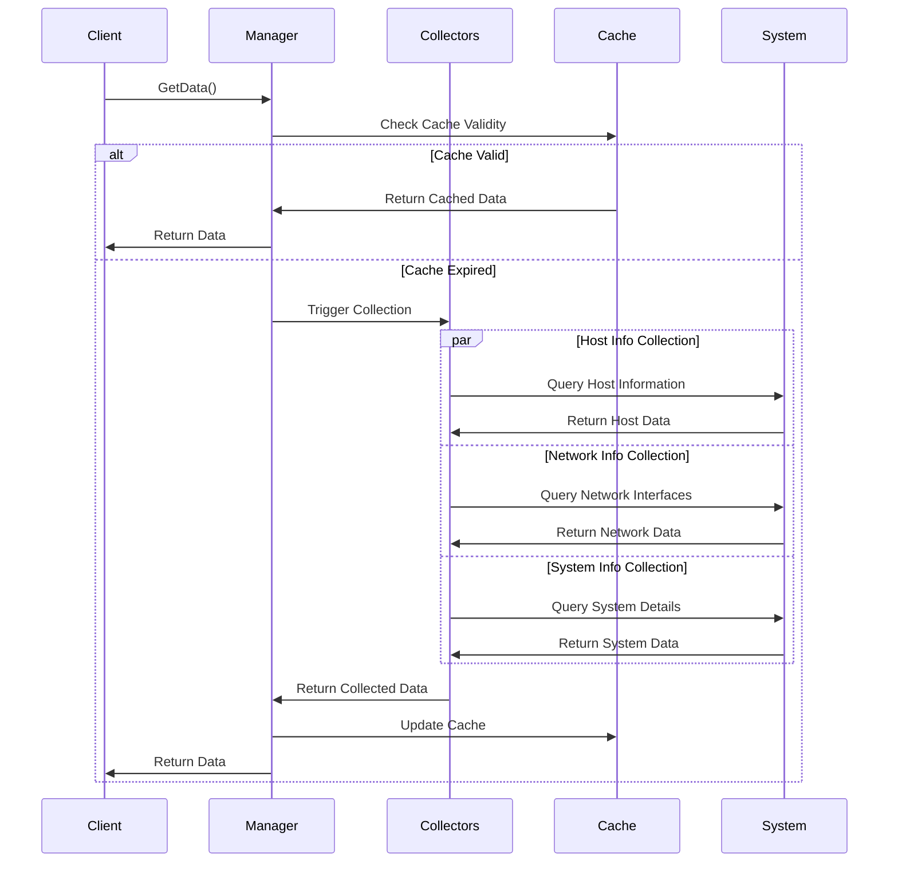

# Machine Info模块设计文档

## 概述

Machine Info模块负责收集和提供主机的基础信息，包括主机名、IP地址、操作系统信息、网络接口配置等。该模块为监控平台提供机器标识和网络拓扑信息，是其他模块运行的基础依赖。

## 架构设计

```mermaid
graph TB
    subgraph "Machine Info Module"
        A[Machine Info Manager] --> B[Host Info Collector]
        A --> C[Network Info Collector]
        A --> D[System Info Collector]
        A --> E[Data Aggregator]
    end
    
    subgraph "Host Information"
        B --> F[Hostname]
        B --> G[OS Information]
        B --> H[Architecture]
        B --> I[Boot Time]
        B --> J[System UUID]
    end
    
    subgraph "Network Information"
        C --> K[Interface Discovery]
        C --> L[IP Address Collection]
        C --> M[MAC Address Collection]
        C --> N[Network Statistics]
        C --> O[Default Gateway]
    end
    
    subgraph "System Information"
        D --> P[Kernel Version]
        D --> Q[Platform Information]
        D --> R[Virtualization Detection]
        D --> S[Container Detection]
    end
    
    subgraph "Data Interface"
        E --> T[dataProvider Interface]
        E --> U[JSON Serialization]
        E --> V[Cache Management]
    end
    
    subgraph "External Dependencies"
        W[gopsutil/host]
        X[gopsutil/net]
        Y[System Calls]
        Z[/proc Filesystem]
    end
    
    B --> W
    C --> X
    C --> Y
    C --> Z
    D --> W
    D --> Y
    D --> Z
```

## 核心功能

### 1. 主机信息收集
收集主机的基本标识信息：
- **主机名**：系统主机名和域名信息
- **操作系统**：操作系统类型、版本、发行版
- **架构信息**：CPU架构、字节序、硬件平台
- **启动时间**：系统启动时间和运行时长
- **系统UUID**：硬件唯一标识符

### 2. 网络信息收集
全面的网络接口和配置信息：
- **接口发现**：自动发现所有网络接口
- **IP地址收集**：IPv4和IPv6地址，包括私有和公网地址
- **MAC地址**：物理网卡的MAC地址
- **网络统计**：接口流量统计和错误信息
- **路由信息**：默认网关和路由表
- **DNS配置**：DNS服务器配置

### 3. 系统信息收集
系统级别的详细信息：
- **内核版本**：操作系统内核版本
- **平台信息**：硬件平台和厂商信息
- **虚拟化检测**：检测是否运行在虚拟机中
- **容器检测**：检测是否运行在容器中
- **系统特性**：支持的系统特性和限制

## 数据模型

### 主机信息结构
```yaml
machine_info:
  hostname: "server-01"
  fqdn: "server-01.example.com"
  os: "linux"
  platform: "ubuntu"
  platform_family: "debian"
  platform_version: "20.04"
  kernel_version: "5.4.0-42-generic"
  kernel_arch: "x86_64"
  virtualization_role: "guest"
  virtualization_system: "kvm"
  boot_time: 1640995200
  uptime: 86400
  host_id: "550e8400-e29b-41d4-a716-446655440000"
```

### 网络接口信息
```yaml
network_interfaces:
  - name: "eth0"
    index: 2
    mtu: 1500
    flags: ["up", "broadcast", "multicast"]
    hardware_addr: "00:11:22:33:44:55"
    addresses:
      - addr: "192.168.1.100"
        netmask: "255.255.255.0"
        network: "192.168.1.0/24"
        type: "ipv4"
      - addr: "fe80::211:22ff:fe33:4455"
        netmask: "ffff:ffff:ffff:ffff::"
        network: "fe80::/64"
        type: "ipv6"
    statistics:
      bytes_sent: 1048576
      bytes_recv: 2097152
      packets_sent: 1024
      packets_recv: 2048
      errors_in: 0
      errors_out: 0
      drops_in: 0
      drops_out: 0
```

### 系统能力信息
```yaml
system_capabilities:
  virtualization: true
  container_runtime: "docker"
  hypervisor: "kvm"
  cpu_count: 4
  memory_total: 8589934592
  swap_total: 2147483648
  architecture: "x86_64"
  endianness: "little"
  page_size: 4096
```

## 数据收集流程



## 缓存策略

### 缓存设计
- **TTL机制**：数据缓存时间根据信息变化频率设定
- **分层缓存**：主机信息缓存时间较长，网络信息缓存时间较短
- **智能刷新**：检测到系统变化时主动刷新缓存
- **内存管理**：缓存大小限制和LRU淘汰策略

### 缓存配置
```yaml
cache_config:
  host_info_ttl: 300s      # 主机信息缓存5分钟
  network_info_ttl: 60s    # 网络信息缓存1分钟
  system_info_ttl: 600s    # 系统信息缓存10分钟
  max_cache_size: 1048576  # 最大缓存大小1MB
  cleanup_interval: 60s    # 清理间隔1分钟
```

## 错误处理

### 1. 信息收集错误
- **部分失败容忍**：某些信息收集失败不影响整体功能
- **降级策略**：使用默认值或缓存数据
- **错误记录**：详细记录失败原因和堆栈信息
- **重试机制**：对临时性失败进行重试

### 2. 系统调用错误
- **权限问题**：处理权限不足的情况
- **系统兼容性**：处理不同操作系统间的差异
- **资源限制**：处理系统资源不足的情况

### 3. 网络信息错误
- **接口不存在**：处理网络接口不存在的情况
- **配置错误**：处理网络配置错误的情况
- **权限限制**：处理网络信息访问权限问题

## 性能优化

### 1. 并发收集
- **并行收集**：多个信息收集器并发执行
- **异步处理**：不阻塞主流程的信息收集
- **资源池化**：复用系统调用和网络连接

### 2. 智能缓存
- **变化检测**：监控系统配置变化
- **增量更新**：只更新变化的信息
- **预加载**：预测性加载可能需要的信息

### 3. 内存优化
- **对象复用**：复用数据结构对象
- **延迟加载**：按需加载详细信息
- **垃圾回收**：及时清理不再使用的对象

## 安全考虑

### 1. 信息暴露
- **敏感信息过滤**：不暴露敏感的主机信息
- **网络信息脱敏**：对IP地址等敏感信息进行处理
- **配置信息保护**：不暴露系统配置细节

### 2. 系统访问
- **最小权限**：使用最小权限访问系统信息
- **安全调用**：使用安全的系统调用方式
- **错误处理**：不泄露系统内部错误信息

### 3. 数据完整性
- **数据验证**：验证收集到的信息完整性
- **一致性检查**：检查不同来源信息的一致性
- **完整性保护**：防止信息在传输过程中被篡改

## 扩展性设计

### 1. 信息源扩展
- **插件机制**：支持自定义信息收集插件
- **数据源适配**：适配不同的信息源
- **格式转换**：支持不同的数据格式

### 2. 平台适配
- **操作系统适配**：支持多种操作系统
- **架构适配**：支持不同的硬件架构
- **容器环境**：适配容器化环境

### 3. 集成扩展
- **API扩展**：支持自定义信息收集API
- **数据导出**：支持不同的数据导出格式
- **外部集成**：与外部系统集成

## 监控和可观测性

### 内部指标
- `machine_info_collection_duration_seconds` - 信息收集耗时
- `machine_info_collection_errors_total` - 收集错误次数
- `machine_info_cache_hit_rate` - 缓存命中率
- `machine_info_data_freshness_seconds` - 数据新鲜度

### 健康检查
- **信息完整性**：检查关键信息的完整性
- **数据时效性**：检查数据的时效性
- **系统可用性**：检查系统信息源的可用性

## 相关文档

- [Agent架构设计](agent.md) - Agent整体架构
- [Metrics模块设计](metrics.md) - 指标收集模块
- [Hardware模块](hardware.md) - 硬件信息模块
- [配置说明](../config/agent.yaml) - 配置文件详细说明