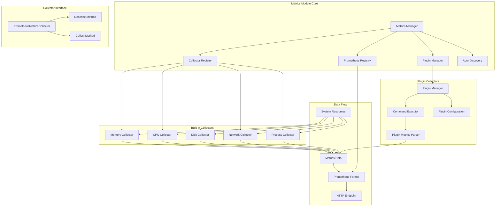
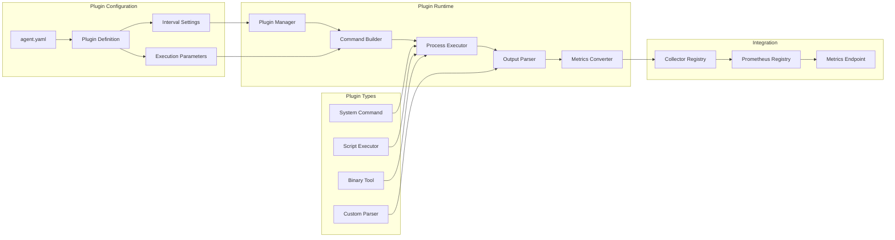
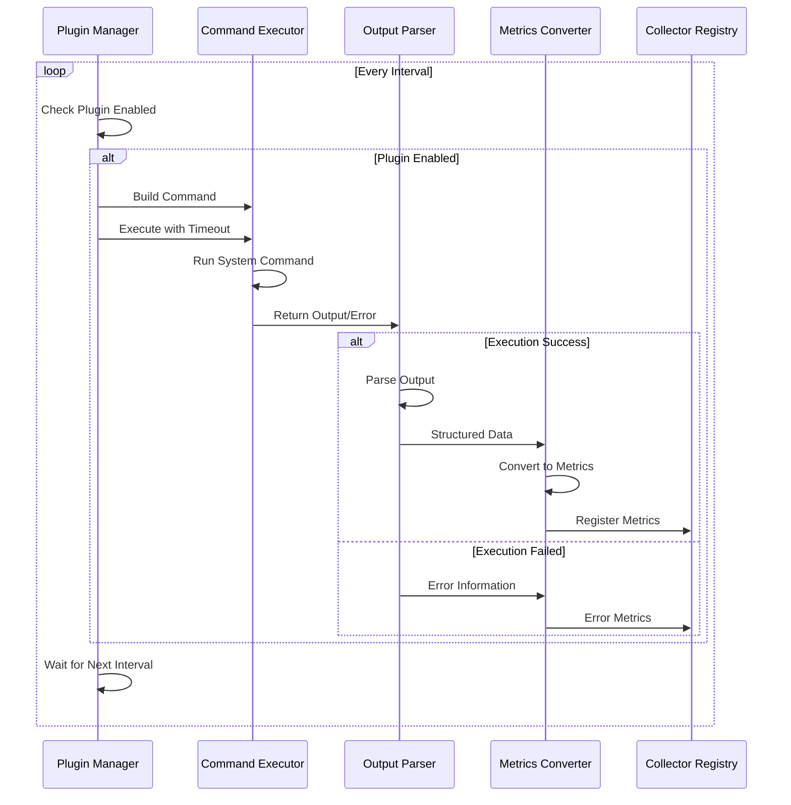
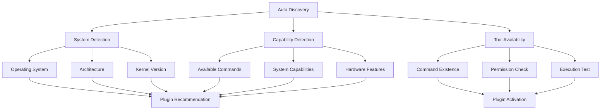

# Metrics模块设计文档

## 概述

Metrics模块是Agent的核心数据收集引擎，负责系统指标的统一收集、管理和导出。基于Prometheus生态设计，采用插件式架构，支持动态扩展和自动发现，为监控平台提供丰富的系统运行指标。

## 架构设计



## 核心组件

### 1. 收集器注册表（Collector Registry）
收集器注册表是Metrics模块的核心管理器，负责：
- **收集器生命周期管理**：注册、注销、状态跟踪
- **依赖关系管理**：处理收集器间的依赖关系
- **并发安全**：支持多goroutine安全访问
- **性能监控**：收集器执行时间统计

### 2. Prometheus注册表集成
- **原生兼容**：直接实现prometheus.Collector接口
- **指标描述**：自动发现和注册指标元数据
- **数据聚合**：多收集器数据统一聚合
- **格式标准化**：确保Prometheus格式兼容性

### 3. 插件管理器（Plugin Manager）
插件管理器负责外部监控工具的集成：
- **配置驱动**：基于配置文件动态启用插件
- **命令执行**：安全执行系统命令和工具
- **结果解析**：标准化插件输出格式解析
- **错误处理**：插件失败时的优雅降级

## 插件机制详解

### 插件架构



### 插件配置结构

插件通过配置文件定义，支持多种执行方式和参数配置：

```yaml
plugins:
  cpu_temperature:
    enabled: true                    # 启用状态
    tool: "osascript"               # 执行工具
    parameters: ["-e", "sysctl -n machdep.cpu.core_temp"]  # 执行参数
    interval: 30s                   # 执行间隔
    description: "CPU温度监控"       # 插件描述
    timeout: 5s                     # 执行超时
    retry_count: 3                  # 重试次数
    metric_name: "baize_cpu_temperature"  # 指标名称
    metric_help: "CPU温度信息"      # 指标说明
    labels:                        # 标签定义
      - name: "core"
        value: "0"
      - name: "type"
        value: "temperature"
```

### 插件执行流程



## 如何新增插件搜集新指标

### 步骤1：定义插件配置
在`agent.yaml`中添加插件配置：

```yaml
plugins:
  disk_io_stats:
    enabled: true
    tool: "iostat"
    parameters: ["-d", "-x", "1", "2"]
    interval: 60s
    description: "磁盘IO统计信息"
    metric_name: "baize_disk_io"
    metric_help: "磁盘IO性能指标"
    labels:
      - name: "device"
        source: "column_0"  # 从输出第0列获取
      - name: "type"
        value: "io_stats"
```

### 步骤2：实现输出解析（可选）
如果标准解析器无法满足需求，可以实现自定义解析器：

```yaml
plugins:
  custom_metric:
    enabled: true
    tool: "custom_command"
    parameters: ["--json"]
    interval: 30s
    parser: "json"  # 使用JSON解析器
    metric_path: "data.metrics"  # JSON路径
```

### 步骤3：验证插件执行
通过HTTP端点验证插件指标：

```bash
# 检查插件指标
curl http://localhost:9100/metrics | grep baize_disk_io

# 检查插件状态
curl http://localhost:9100/api/v1/plugins
```

### 步骤4：监控插件健康
插件健康状态通过以下指标暴露：
- `baize_plugin_execution_total` - 执行次数
- `baize_plugin_execution_errors_total` - 执行错误次数
- `baize_plugin_execution_duration_seconds` - 执行耗时

## 自动发现机制

### 系统级自动发现



### 动态插件加载
自动发现过程：
1. **系统检测**：识别操作系统类型和版本
2. **能力检测**：发现系统支持的监控功能
3. **工具可用性**：检查监控工具是否存在
4. **插件推荐**：基于检测结果推荐合适的插件
5. **动态激活**：自动启用匹配的插件

## Prometheus集成

### 指标命名规范
- **前缀统一**：所有指标以`baize_`开头
- **层级结构**：模块.子系统.指标名
- **类型标识**：使用标准Prometheus类型（counter, gauge, histogram）

### 指标类型映射
```yaml
# 自动类型检测
metric_types:
  counter: ["total", "count", "operations"]
  gauge: ["current", "temperature", "usage", "percentage"]
  histogram: ["duration", "latency", "size"]
  summary: ["rate", "average"]
```

### 标签设计
- **维度标识**：主机、设备、类型等维度
- **环境信息**：环境、集群、区域等标签
- **业务标签**：支持用户自定义标签

## 性能优化

### 1. 并发收集
- **并行执行**：多个收集器并发运行
- **资源隔离**：避免收集器间相互影响
- **超时控制**：防止单个收集器阻塞

### 2. 缓存机制
- **指标缓存**：频繁访问数据缓存
- **计算缓存**：复杂计算结果缓存
- **配置缓存**：配置解析结果缓存

### 3. 采样策略
- **自适应采样**：根据系统负载调整采样频率
- **智能降级**：高负载时降低采样精度
- **增量更新**：只收集变化的数据

## 监控和可观测性

### 内部指标
模块自身运行状态监控：
- `baize_metrics_collectors_total` - 注册收集器数量
- `baize_metrics_collection_duration_seconds` - 收集耗时
- `baize_metrics_collection_errors_total` - 收集错误数
- `baize_plugin_execution_status` - 插件执行状态

### 健康检查
- **收集器状态**：每个收集器的健康状态
- **插件状态**：插件启用/禁用状态
- **性能指标**：收集延迟、错误率等
- **资源使用**：内存、CPU使用情况

## 错误处理

### 1. 收集器错误
- **隔离机制**：单个收集器失败不影响其他收集器
- **错误记录**：详细记录错误信息和堆栈
- **自动恢复**：定期重试失败的收集器
- **降级策略**：使用缓存数据或默认值

### 2. 插件错误
- **执行超时**：防止插件执行hang住
- **输出验证**：验证插件输出格式
- **错误分类**：区分临时错误和永久错误
- **告警机制**：关键插件失败时发送告警

## 相关文档

- [Agent架构设计](agent.md) - Agent整体架构
- [配置说明](../config/agent.yaml) - 插件配置详细说明
- [Prometheus最佳实践](https://prometheus.io/docs/practices/) - Prometheus使用指南
- [插件开发指南](plugin_development.md) - 自定义插件开发（待创建）